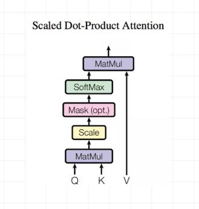

# Transformer 

Paper: [Attention is all you need](https://arxiv.org/pdf/1706.03762.pdf)

## Base Architecture of Transformer

### Main Architecture

<div align="center">
  
</div>

```python
class Transformer(nn.Module):
    def __init__(self, opt):
        super(Transformer, self).__init__()

        # pad_idx inputs和outputs中的pad token值,构建self-attention中的mask,消除pad token对模型影响
        self.src_pad_idx, self.trg_pad_idx = opt.src_pad_idx, opt.trg_pad_idx

        # 初始化Transformer Encoder, 输入参数n_layers Encoder block的各数即右图Nx；
        # opt.d_k, opt.d_v 键(k)向量和值(v)向量的通道维数
        # opt.d_model 模型维数，在transformer中表示word_embed的维度，attn和MLP输出的维度基数
        # opt.d_ff MLP(Multi-layer Perception,多层感知机，全连接层，即右图Feed forward)的隐层通道维数
        # opt.n_heads Multi-head attn层的头数
        # opt.max_src_seq_len 输入序列token的长度
        # opt.src_vocab_size 词向量对应库包含的词维度，控制nn.embedding输入值的范围
        self.encoder = Encoder(opt.n_layers, opt.d_k, opt.d_v, opt.d_model, opt.d_ff, opt.n_heads,
            opt.src_pad_idx, opt.src_vocab_size, opt.d_word_vec, opt.max_src_seq_len, opt.dropout)

        # 初始化Transformer Decoder, 参数类比Encoder
        self.decoder = Decoder(opt.n_layers, opt.d_k, opt.d_v, opt.d_model, opt.d_ff, opt.n_heads,
            opt.trg_pad_idx, opt.src_vocab_size, opt.d_word_vec, opt.max_tgt_seq_len, opt.dropout)
            
        # 最终输出层的全连接层
        self.tgt_proj = Linear(opt.d_model, opt.tgt_vocab_size, bias=False)
        self.weighted_model = opt.weighted_model

        # 共享Embedding weight, 通过执行A.weight=B.weight,使得A.weight指向B.weight相同的内存位置。
        # 对A.weight的修改同样影响B.weight，反之亦然
        # 该操作等价与
        # shared_weight = nn.Parameter(torch.randn(size))
        # A.weight = shared_weight
        # B.weight = shared_weight

        # 模型输出层和Decoder的output embed 共享权值，
        # 此时要求embed能够从文字编码生成wordvect,同样也能从wordvect返还成文字编码
        if opt.share_proj_weight:
            print('Sharing target embedding and projection..')
            self.tgt_proj.weight = self.decoder.tgt_emb.weight

        # input embed 和 output embed 共享权值
        if opt.share_embs_weight:
            print('Sharing source and target embedding..')
            assert opt.src_vocab_size == opt.tgt_vocab_size, \
                'To share word embeddings, the vocabulary size of src/tgt should be the same'
            self.encoder.src_emb.weight = self.decoder.tgt_emb.weight

    def forward(self, src_seq, trg_seq):        
        # 输入输出序列维度 ：[b_size x l_seq],
        src_mask = get_pad_mask(src_seq, self.src_pad_idx)
        # 对pad_mask和causal mask求与
        trg_mask = get_pad_mask(trg_seq, self.trg_pad_idx) & get_subsequent_mask(trg_seq)

        # train阶段的infer过程，依照右图对模块进行连接
        # self.encoder即右图的左半部分，包括了Encoder block, input Embedding, Positional Encoding
        enc_output, *_ = self.encoder(src_seq, src_mask)
        # self.decoder即右图的右半部分，包括了Decoder block, output Embedding, Positional Encoding
        # Encoder final Layer的输出enc_output作为Decoder block的corss-Attn输入接入模块
        dec_output, *_ = self.decoder(trg_seq, trg_mask, enc_output, src_mask)
        # Decoder final Layer的输出后的Linear(全连接)层
        seq_logit = self.trg_word_prj(dec_output)

        return seq_logit.view(-1, seq_logit.size(2))

# 输入输出序列中和pad token相同的值置True,对attn的softmax output做掩码
def get_pad_mask(seq, pad_idx):
    # return seq dim : [b_size x 1 x l_seq],
    # 这里unsqueeze(-2)是使得mask和softmax output的shape能够对齐(broadcastable)
    return (seq != pad_idx).unsqueeze(-2)

# 生成Decoder的self attn掩码
def get_subsequent_mask(seq):
    ''' For masking out the subsequent info. '''
    sz_b, len_s = seq.size()
    # torch.triu() Returns the upper triangular part of a matrix (2-D tensor) or batch of matrices input, 
    # the other elements of the result tensor out are set to 0. 
    # 返回依照diagonal位置返回input的左上三角部分,其他值设置成0,diagonal为正时在主对角线之上,反之在主对角线之下
    # 这里生成Decoder的self attn掩码，为右下三角区域，使得模型每个输出序列的位置只能得到其和其位置之前的输出信息,
    # 在一个batch中实现递进估计
    subsequent_mask = (1 - torch.triu(
        torch.ones((1, len_s, len_s), device=seq.device), diagonal=1)).bool()
    # The same as torch.tril(torch.ones(1,len_s,len_s),diagnonal=-1,device=seq.device).bool()
    # return output self-attn mask dim : [1 x l_seq x l_seq],
    return subsequent_mask
```

### Left branch Transformer Encoder & Encoder Block

<div align="center">
  
</div>

```python
'''Encoder branch'''
class Encoder(nn.Module):
    ''' A encoder model with self attention mechanism. '''
    def __init__(self, n_layers, d_k, d_v, d_model, d_inner, n_head, n_src_vocab, 
        pad_idx,  n_src_vocab, d_word_vec, n_position=200, dropout=0.1, scale_emb=False):

        super().__init__()

        # torch.nn.Embedding将输入的src_seq中的每一个元素转变成d_word_vec长度的向量
        # 输入src_seq dim: [size], 输出enc_output: [size, d_word_vec]
        self.src_word_emb = nn.Embedding(n_src_vocab, d_word_vec, padding_idx=pad_idx)
        self.position_enc = PositionalEncoding(d_word_vec, n_position=n_position)
        self.dropout = nn.Dropout(p=dropout)
        # 连接n_layers个EncEncoderLayer block
        self.layer_stack = nn.ModuleList([
            EncEncoderLayer(d_model, d_inner, n_head, d_k, d_v, dropout=dropout)
            for _ in range(n_layers)])
        self.layer_norm = nn.LayerNorm(d_model, eps=1e-6)
        self.scale_emb = scale_emb
        self.d_model = d_model

    def forward(self, src_seq, src_mask, return_attns=False):
        enc_slf_attn_list = []
        # -- Forward
        enc_output = self.src_word_emb(src_seq)
        if self.scale_emb:
            enc_output *= self.d_model ** 0.5
        enc_output = self.dropout(self.position_enc(enc_output))
        enc_output = self.layer_norm(enc_output)

        for enc_layer in self.layer_stack:
            # 每个EncoderLayer block的输出作为下一个block的输入
            enc_output, enc_slf_attn = enc_layer(enc_output, slf_attn_mask=src_mask)
            enc_slf_attn_list += [enc_slf_attn] if return_attns else []

        if return_attns:
            return enc_output, enc_slf_attn_list
        return enc_output,

'''EncoderLayer block'''
class EncoderLayer(nn.Module):
    '''
    如右图所示每个EncoderLayer block包含两层结构,
    1.对输入做Mutil-Head self-attn,2.self-attn的输出经过一个全连接网络
    '''

    def __init__(self, d_model, d_inner, n_head, d_k, d_v, dropout=0.1):
        super(EncoderLayer, self).__init__()
        self.slf_attn = MultiHeadAttention(n_head, d_model, d_k, d_v, dropout=dropout)
        self.pos_ffn = PositionwiseFeedForward(d_model, d_inner, dropout=dropout)

    def forward(self, enc_input, slf_attn_mask=None):
        enc_output, enc_slf_attn = self.slf_attn(
            enc_input, enc_input, enc_input, mask=slf_attn_mask)
        enc_output = self.pos_ffn(enc_output)
        return enc_output, enc_slf_attn
```

### Right branch Transformer Decoder & Decoder Block

<div align="center">
  
</div>

```python
'''Decoder branch'''
class Decoder(nn.Module):
    ''' A decoder model with self attention mechanism. '''

    def __init__(self, n_layers, d_k, d_v, d_model, d_inner, n_head, n_trg_vocab, 
        pad_idx,  n_src_vocab, d_word_vec, n_position=200, dropout=0.1, scale_emb=False):

        super().__init__()

        self.trg_word_emb = nn.Embedding(n_trg_vocab, d_word_vec, padding_idx=pad_idx)
        self.position_enc = PositionalEncoding(d_word_vec, n_position=n_position)
        self.dropout = nn.Dropout(p=dropout)
        self.layer_stack = nn.ModuleList(
            [DecoderLayer(d_model, d_inner, n_head, d_k, d_v, dropout=dropout)
            for _ in range(n_layers)])
        self.layer_norm = nn.LayerNorm(d_model, eps=1e-6)
        self.scale_emb = scale_emb
        self.d_model = d_model

    def forward(self, trg_seq, trg_mask, enc_output, src_mask, return_attns=False):
        dec_slf_attn_list, dec_enc_attn_list = [], []
        # -- Forward
        dec_output = self.trg_word_emb(trg_seq)
        if self.scale_emb:
            dec_output *= self.d_model ** 0.5
        dec_output = self.dropout(self.position_enc(dec_output))
        dec_output = self.layer_norm(dec_output)

        for dec_layer in self.layer_stack:
            dec_output, dec_slf_attn, dec_enc_attn = dec_layer(
                dec_output, enc_output, slf_attn_mask=trg_mask, dec_enc_attn_mask=src_mask)
            dec_slf_attn_list += [dec_slf_attn] if return_attns else []
            dec_enc_attn_list += [dec_enc_attn] if return_attns else []

        if return_attns:
            return dec_output, dec_slf_attn_list, dec_enc_attn_list
        return dec_output,

'''DecoderLayer block'''
class DecoderLayer(nn.Module):
    '''
    如右图所示每个DecoderLayer block包含三层结构,
    1.对输入做Mutil-Head self-attn,
    2.对self-attn的输出和Transformer Encoder的最终输出做Mutil-Head cross-attn,
    3.cross-attn的输出经过一个全连接网络
    '''

    def __init__(self, d_model, d_inner, n_head, d_k, d_v, dropout=0.1):
        super(DecoderLayer, self).__init__()
        self.slf_attn = MultiHeadAttention(n_head, d_model, d_k, d_v, dropout=dropout)
        self.enc_attn = MultiHeadAttention(n_head, d_model, d_k, d_v, dropout=dropout)
        self.pos_ffn = PositionwiseFeedForward(d_model, d_inner, dropout=dropout)

    def forward(self, dec_input, enc_output,slf_attn_mask=None, dec_enc_attn_mask=None):
        dec_output, dec_slf_attn = self.slf_attn(
            dec_input, dec_input, dec_input, mask=slf_attn_mask)
        # 第二个MultiHeadAttention Layer接入Transformer Encoder的最终输出,进行cross attn
        dec_output, dec_enc_attn = self.enc_attn(
            dec_output, enc_output, enc_output, mask=dec_enc_attn_mask)
        dec_output = self.pos_ffn(dec_output)
        return dec_output, dec_slf_attn, dec_enc_attn
```

### MutilHeadAttention

#### Scale Dot-Product Attention

根据dot-product attention(如下式)计算向量Q,K,V之间的attn

<image src="./images/AttentionEqn.svg">

对dot-product attention除以temperature scale value $\sqrt{d_k}$, 是因为查询向量Q，和键值向量K,时对其输入的投影,
特别是self-attn时 $Q=w_qx,K=w_kx$。而输入x已经过layerNorm,即x得分布符合标准正态分布 $N~(0,1)$。因此 $QK^T=w_qxx^Tw_k^T$,
$xx^T$ 中的元素等于 $\sum^{d_k}_{i=1} x_{inq} x_{ink}$ 近似于 $\chi^2$ 分布，其方差为 $d_k$。当 $d_k$ 增大时, $QK^T$ 输出
的分布方差增大,使得softmax的梯度更新梯度很小,通过除以 $\sqrt{d_k}$，使得输出分布方差回归1。

<div align="center">
  
</div>

```python
class ScaledDotProductAttention(nn.Module):
    ''' Scaled Dot-Product Attention '''

    def __init__(self, temperature, attn_dropout=0.1):
        super().__init__()
        # temperature=d_k ** 0.5
        self.temperature = temperature
        self.dropout = nn.Dropout(attn_dropout)

    def forward(self, q, k, v, mask=None):
        # q: [b_size x n_heads x len_q x d_k]
        # k: [b_size x n_heads x len_k x d_k]
        # v: [b_size x n_heads x len_k x d_v]

        attn = torch.matmul(q / self.temperature, k.transpose(2, 3))
        # attn: when self-attn [b_size x n_heads x len_k x len_k]
        #       when cross-sttn [b_size x n_heads x len_q x len_k]

        if mask is not None:
            # mask: when encoder self-attn [b_size x 1 x 1 x len_k]
            #       when decoder self-attn [1 x 1 x len_k x len_k]
            #       when decoder cross-attn [b_size x 1 x 1 x len_k]
            # torch.Tensor.masked_fill 维度必须相等，或者其中一个为1，或者不存在时，
            # 可以从尾部维度开始，填充维度，即broadcastable 
            attn = attn.masked_fill(mask == 0, -1e9)
        
        attn = self.dropout(F.softmax(attn, dim=-1))
        output = torch.matmul(attn, v)
        # output: [b_size x n_heads x len_q x d_v]
        return output, attn
```

#### Multi-Head Attention

<div align="center">
  
</div>

```python
class MultiHeadAttention(nn.Module):
    ''' Multi-Head Attention module '''

    def __init__(self, n_head, d_model, d_k, d_v, dropout=0.1):
        super().__init__()

        self.n_head = n_head
        self.d_k = d_k
        self.d_v = d_v

        # 通过全连接将输入vector的维度从d_vector投影到n_head个d_vector，
        # 即维度n_head * d_vector,实现Multi-Head操作。
        # Multi-Head能够利用投影获得不同子空间内的信息
        self.w_qs = nn.Linear(d_model, n_head * d_k, bias=False)
        self.w_ks = nn.Linear(d_model, n_head * d_k, bias=False)
        self.w_vs = nn.Linear(d_model, n_head * d_v, bias=False)
        self.fc = nn.Linear(n_head * d_v, d_model, bias=False)

        self.attention = ScaledDotProductAttention(temperature=d_k ** 0.5)

        self.dropout = nn.Dropout(dropout)
        self.layer_norm = nn.LayerNorm(d_model, eps=1e-6)


    def forward(self, q, k, v, mask=None):

        d_k, d_v, n_head = self.d_k, self.d_v, self.n_head
        sz_b, len_q, len_k, len_v = q.size(0), q.size(1), k.size(1), v.size(1)

        residual = q

        # Pass through the pre-attention projection: b x lq x (n*dv)
        # Separate different heads: b x lq x n x dv
        q = self.w_qs(q).view(sz_b, len_q, n_head, d_k)
        k = self.w_ks(k).view(sz_b, len_k, n_head, d_k)
        v = self.w_vs(v).view(sz_b, len_v, n_head, d_v)

        # Transpose for attention dot product: b x n x lq x dv
        q, k, v = q.transpose(1, 2), k.transpose(1, 2), v.transpose(1, 2)
        # 因为Scale Dot-Product Attention的计算作用在最后两个维度上，通过view(),和transpose()操作，
        # 使得MultiheadAttention的计算实现并行。

        if mask is not None:
            # 对mask添加维度(unsqueeze(1)),使得mask对Attention中softmax后的结果维度上符合broadcastable
            mask = mask.unsqueeze(1)   # For head axis broadcasting.

        q, attn = self.attention(q, k, v, mask=mask)

        # Transpose to move the head dimension back: b x lq x n x dv
        # Combine the last two dimensions to concatenate all the heads together: b x lq x (n*dv)
        q = q.transpose(1, 2).contiguous().view(sz_b, len_q, -1)
        q = self.dropout(self.fc(q))
        q += residual
        # LayerNorm作用在输入的最后两维上,即作用在HW维度上,即对一个输入序列
        # 在一个channel(属性)内部对所有词的词义视作一个分布,并将其标准化。
        # 每个词在该属性内的相对大小得到保留，不改变其方向。
        q = self.layer_norm(q)
        return q, attn
```

### Position-wise Feed-forward Networks

全连接网络实现如下方程

<image src="./images/fc.svg">

```python
class PositionwiseFeedForward(nn.Module):
    ''' A two-feed-forward-layer module '''

    def __init__(self, d_in, d_hid, dropout=0.1):
        super().__init__()
        self.w_1 = nn.Linear(d_in, d_hid)
        self.w_2 = nn.Linear(d_hid, d_in)
        self.layer_norm = nn.LayerNorm(d_in, eps=1e-6)
        self.dropout = nn.Dropout(dropout)

    def forward(self, x):
        residual = x
        x = self.w_2(F.relu(self.w_1(x)))
        x = self.dropout(x)
        x += residual
        x = self.layer_norm(x)
        return x
```

# 内容延伸

1. [Transforner Base Architecture](./README_transformer.md)

2. [TR Encoder Model ViTs](./README_ViT.md)

3. [Pos-Emb in TR](./README_pos_emb.md)

4. [Visual object track](./README_visual_object_track.md)

5. [Object Detection based on transformer](./README_detection.md)

## various structures of Transformer
For various structures of Transformer, there is a more comprehensive collection on GitHub, the corresponding repository link is:https://github.com/xmu-xiaoma666/External-Attention-pytorch