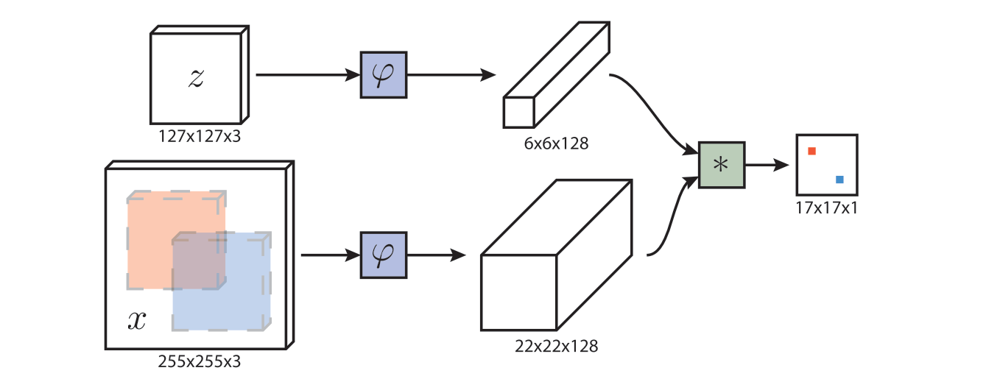

# Visual object tracking

Visual object tracking的任务是实现在视频序列中对特定目标对象进行定位和追踪的任务。

## Siamese FC

Paper[Fully-convolutional Siamese Networks for Object Tracking](https://arxiv.org/pdf/1606.09549v3)



Siamese FC .在我看来某种意义上依旧遵循模板匹配的思路，传统模板匹配依赖手工设计的特征(SIFT,SURF等),Siamese FC则利用Fully Conv Net进行图像特征提取。通过交叉相关(cross-correlation)来计算相似性，和传统模板匹配中区域之间的相似性度量在概念上是接近的。

<details>
<summary>code for Siamese FC</summary>

The code comes from https://github.com/HonglinChu/SiamTrackers

```python
# 从模块化的角度说SiameseFC结构出奇简单

# comes from /SiamTrackers/SiamFC/SiamFC/siamfc/network.py
class SiamFCNet(nn.Module):

    def __init__(self, backbone, head):
        super(SiamFCNet, self).__init__()
        self.features = backbone
        self.head = head

    def forward(self, z, x):
        # template和search region图像均通过backbone生成各自的feature
        z = self.features(z)
        x = self.features(x)
        return self.head(z, x)

# comes from /SiamTrackers/SiamFC/SiamFC/siamfc/heads.py
class SiamFC(nn.Module):

    def __init__(self, out_scale=0.001):
        super(SiamFC, self).__init__()
        self.out_scale = out_scale

    def forward(self, z, x):
        return self._fast_xcorr(z, x) * self.out_scale

    def _fast_xcorr(self, z, x):
        # 这里nx=scale_num*视频个数，因为Siamese中应对目标尺寸变化的方式是通过裁剪和resize search region(待检测图像)实现的
        # nz=视频个数(即针对每个视频track一个temp)
        nz = z.size(0)
        nx, c, h, w = x.size()
        x = x.view(-1, nz * c, h, w) # 通过view将x转化为视频（scale_num 视频个数*特征维度 ...)的结构
        out = F.conv2d(x, z, group=nz) # 分组卷积，在channel维度上拆分成视频个数nz个块，对每个视频都之和自己的temp做xcorr
        out = out.view(nx, -1, out.size(-2), out.size(-1)) 
        return out

# comes from /SiamTrackers/SiamFC/SiamFC/siamfc/tracker.py
class SiamFCTracker(Tracker):  

    @torch.no_grad() 
    def init(self, img, box): # 根据输入的box位置提取temp,并初始化部分模型推断之外的box估计参数
        self.net.eval() # set to evaluation mode

        # convert tlbr box to 0-indexed and center based [cy, cx, bh, bw]
        box = np.array([ box[1] - 1 + (box[3] - 1) / 2, box[0] - 1 + (box[2] - 1) / 2, box[3], box[2]], dtype=np.float32)
        self.center, self.target_sz = box[:2], box[2:] 

        # create hanning window  response_up=16 ；  response_sz=17 ； self.upscale_sz=272
        # 构建一个汉宁窗,用于目标box的平滑估计，response_sz model output size, response_up output和原始图像之间的尺寸比例
        self.upscale_sz = config.response_up * config.response_sz  
        self.hann_window = np.outer( np.hanning(self.upscale_sz), np.hanning(self.upscale_sz)) #窗尺寸 upscale_sz*upscale_sz
        self.hann_window /= self.hann_window.sum()  #归一化汉宁窗,使得窗代表的权重和为1

        # search scale factors
        self.scale_factors = config.scale_step ** np.linspace(-(config.scale_num // 2), 
            config.scale_num // 2, config.scale_num) # 生成长度scale_num,以0为中心步进1的序列，用于缩放图像区域的尺寸
        
        # exemplar and search sizes  config.context=1/2  
        context = config.context * np.sum(self.target_sz)    # 引入margin：2P=(长+宽）× 1/2
        self.z_sz = np.sqrt(np.prod(self.target_sz + context)) # ([长，宽]+2P) x 2 添加 padding  没有乘以缩放因子 原图中截取temp尺寸
        self.x_sz = self.z_sz *config.instance_sz / config.exemplar_sz  # 226   没有乘以缩放因子 原图尺寸
        # z是初始模板的大小 x是搜索区域
        # exemplar image 
        self.avg_color = np.mean(img, axis=(0, 1)) # 计算RGB通道的均值,使用图像均值进行padding
        # 从原图中获取初始模板,输入网络的模板尺寸exemplar_sz*exemplar_sz
        z = crop_and_resize(img, self.center, self.z_sz, out_size=config.exemplar_sz, border_value=self.avg_color)
        
        #对所有的图片进行预处理，得到127x127大小的patch
        # exemplar features：[B C H W]
        z = torch.from_numpy(z).cuda().permute(2, 0, 1).unsqueeze(0).float() 

        self.kernel = self.net.features(z) #计算temp的feature map并固定作xcorr用
    
    @torch.no_grad() 
    def update(self, img): #tracking时更新目标坐标
        # set to evaluation mode
        self.net.eval()

        # search images 从原图corp x_sz * f的区域在resize到instance_sz的统一大小，实现目标尺度变换
        x = [crop_and_resize( img, self.center, self.x_sz * f,  out_size=config.instance_sz, border_value=self.avg_color) 
            for f in self.scale_factors]
        x = np.stack(x, axis=0)
        x = torch.from_numpy(x).cuda().permute(0, 3, 1, 2).float()
        
        # responses
        x = self.net.features(x)
        responses = self.net.head(self.kernel, x)
        responses = responses.squeeze(1).cpu().numpy() # 对batch=1即只有一个模板即跟踪分析时，responses：[B H W]

        # upsample responses and penalize scale changes
        responses = np.stack([cv2.resize( u, (self.upscale_sz, self.upscale_sz), interpolation=cv2.INTER_CUBIC) for u in responses])
        responses[:config.scale_num // 2] *= config.scale_penalty
        responses[config.scale_num // 2 + 1:] *= config.scale_penalty # 和整体乘config.scale_penalty有啥区别？

        # peak scale
        scale_id = np.argmax(np.amax(responses, axis=(1, 2))) # 这里取出xcorr对应的最大的scale,scale包含了目标需要缩放的比例

        # peak location
        response = responses[scale_id] # scale对应的output feature map
        response -= response.min()
        response /= response.sum() + 1e-16 # 对response归一化,response:[H W]
        response = (1 - config.window_influence) * response + config.window_influence * self.hann_window # 和上一时刻汉宁窗加权求和,平滑
        loc = np.unravel_index(response.argmax(), response.shape) # argmax获得最大位置的平铺索引，np.unravel_index将其变换成多为索引

        # locate target center
        disp_in_response = np.array(loc) - (self.upscale_sz - 1) / 2 # 裁剪padding长度
        disp_in_instance = disp_in_response * config.total_stride / config.response_up #转换成原图大小
        disp_in_image = disp_in_instance * self.x_sz * self.scale_factors[scale_id] / config.instance_sz
        self.center += disp_in_image # 更新box中心点，因为是self变量在实例内其他地方的引用都生效

        # update target size
        scale =  (1 - config.scale_lr) * 1.0 + config.scale_lr * self.scale_factors[scale_id] 
        # Siamese假设对search region,是当前最大xcorr值对应的尺度对历史的平滑
        self.target_sz *= scale
        self.z_sz *= scale
        self.x_sz *= scale

        # return 1-indexed and left-top based bounding box  [cx,cy,bw,bh]
        box = np.array([self.center[1] + 1 - (self.target_sz[1] - 1) / 2, self.center[0] + 1 - (self.target_sz[0] - 1) / 2,
            self.target_sz[1], self.target_sz[0]])

        return box
```

</details>

## Spatio-temporal transformer network for visual tracking (STARK)

Paper:[Learning Spatio-Temporal Transformer for Visual Tracking](https://arxiv.org/pdf/2103.17154)

<image src="./images/STARK_spatial_only.jpeg">
<image src="./images/STARK_spatial-temporal.jpeg">

STARK是参考了SiameseFC和DETR网络构建的Visual object trasking网络。

<details>
<summary>code for STARK</summary>

The codes comes from https://github.com/researchmm/Stark

### STARK spatial only (left figure above)

最基本的STARK结构,继承SiameseFC类的backbone对temp和search region进行特征提取(这里我认为主要是用来缩小图像的尺寸,即缩短输入transformer的序列长度,用来减少transformer的attn计算量),继承DETR的目标(对object query)的坐标进行回归。

<details>

```python
# 代码做了截取,只用于描述推断过程。

# comes from /Stark/lib/test/tracker/stark_s.py
class STARK_S(BaseTracker):
    def initialize(self, image, info: dict):
        # initialize用于初始化temp通过backbone后的feature map
        # 因为在STARK spatial only,temp不进行更新,所以在确定temp后可以提前计算temp的feature map,参与后续运算。
        z_patch_arr, _, z_amask_arr = sample_target(image, info['init_bbox'], self.params.template_factor,
                                                    output_sz=self.params.template_size)
        template = self.preprocessor.process(z_patch_arr, z_amask_arr)
        with torch.no_grad():
            self.z_dict1 = self.network.forward_backbone(template)

    def track(self, image, info: dict = None):

        H, W, _ = image.shape
        self.frame_id += 1
        # 
        x_patch_arr, resize_factor, x_amask_arr = sample_target(image, self.state, self.params.search_factor,
                                                                output_sz=self.params.search_size)  # (x1, y1, w, h)
        search = self.preprocessor.process(x_patch_arr, x_amask_arr)
        with torch.no_grad():
            # 这里因为STARK需要分别对temp和search region计算其feature map,即two stream结构,所以整个network被分成了两部分。
            # 1.network.forward_backbone计算fature map,这一部分继承自SiameseFC网络
            # 2.network.forward_transformer通过cat temp和search region的序列送入Transformer Encoder-Decoder结构,
            # 通过Head prediction估计track目标的坐标,这一部分继承自DETR网络
            x_dict = self.network.forward_backbone(search)
            # merge the template and the search
            feat_dict_list = [self.z_dict1, x_dict] # 因为transformer网络不限制输入序列的长度,可以通过直接连接temp和search region的feature序列
            seq_dict = merge_template_search(feat_dict_list)
            # run the transformer
            out_dict, _, _ = self.network.forward_transformer(seq_dict=seq_dict, run_box_head=True)

# comes from /Stark/lib/models/stark/stark_s.py
class STARKS(nn.Module):
    """ This is the base class for Transformer Tracking """
    def forward_backbone(self, input: NestedTensor):
        """The input type is NestedTensor, which consists of:
               - tensor: batched images, of shape [batch_size x 3 x H x W]
               - mask: a binary mask of shape [batch_size x H x W], containing 1 on padded pixels
        """
        assert isinstance(input, NestedTensor)
        # Forward the backbone
        output_back, pos = self.backbone(input)  # features & masks, position embedding for the search
        # Adjust the shapes
        return self.adjust(output_back, pos) #通过adjust将卷积网络输出的[B C H W]序列转化为[(HW) B C]方便序列cat输入transformer结构
    
    def adjust(self, output_back: list, pos_embed: list):
        src_feat, mask = output_back[-1].decompose()
        assert mask is not None
        # reduce channel
        feat = self.bottleneck(src_feat)  # (B, C, H, W)
        # adjust shapes
        feat_vec = feat.flatten(2).permute(2, 0, 1)  # HWxBxC
        pos_embed_vec = pos_embed[-1].flatten(2).permute(2, 0, 1)  # HWxBxC
        mask_vec = mask.flatten(1)  # BxHW
        return {"feat": feat_vec, "mask": mask_vec, "pos": pos_embed_vec}

    def forward_transformer(self, seq_dict, run_box_head=True, run_cls_head=False):
        if self.aux_loss:
            raise ValueError("Deep supervision is not supported.")
        # Forward the transformer encoder and decoder
        # seq_dict["feat"] [(Hz*Wz+Hs*Ws) B C]
        # self.query_embed = nn.Embedding(num_queries, hidden_dim)  # object queries， num_queries和DETR中的意义一样代表有多少个目标
        output_embed, enc_mem = self.transformer(seq_dict["feat"], seq_dict["mask"], self.query_embed.weight,
                                                 seq_dict["pos"], return_encoder_output=True)
        # output_embed是Decoder layer中query_embed的输出，enc_mem是encoder的feature seq
        # Forward the corner head
        out, outputs_coord = self.forward_box_head(output_embed, enc_mem)
        return out, outputs_coord, output_embed

    def forward_box_head(self, hs, memory):
        """
        hs: output embeddings (1, B, N, C)
        memory: encoder embeddings (HW1+HW2, B, C)"""
        if self.head_type == "CORNER":
            # adjust shape 截取属于search region部分的transformer output
            enc_opt = memory[-self.feat_len_s:].transpose(0, 1)  # encoder output for the search region (B, HW, C)
            dec_opt = hs.squeeze(0).transpose(1, 2)  # (B, C, N)
            att = torch.matmul(enc_opt, dec_opt)  # (B, HW, N)
            opt = (enc_opt.unsqueeze(-1) * att.unsqueeze(-2)).permute((0, 3, 2, 1)).contiguous()  # (B, HW, C, N) --> (B, N, C, HW)
            bs, Nq, C, HW = opt.size()
            opt_feat = opt.view(-1, C, self.feat_sz_s, self.feat_sz_s)
            # run the corner head
            outputs_coord = box_xyxy_to_cxcywh(self.box_head(opt_feat))
            outputs_coord_new = outputs_coord.view(bs, Nq, 4)
            out = {'pred_boxes': outputs_coord_new}
            return out, outputs_coord_new
        elif self.head_type == "MLP":
            # 在MLP_head计算pred_boxes的方法和DETR中的方法一致，都是利用query_embed经过Transformer Decoder的输出直接进行box回归。
            # 在Visual object tracking因为temp的关系，不需要像DETR一样对输出序列和所属目标进行匈牙利法匹配
            # 在文中有叙述一般不采用MLP_Head进行box回归，因为和CORNER方法比较，直接使用query embed的输出估计accurary较低。
            # Forward the class and box head
            outputs_coord = self.box_head(hs).sigmoid()
            out = {'pred_boxes': outputs_coord[-1]}
            if self.aux_loss:
                out['aux_outputs'] = self._set_aux_loss(outputs_coord)
            return out, outputs_coord

# comes from /Stark/lib/models/stark/transformer.py
class Transformer(nn.Module):
    # 标准的Transformer结构，通过参数可以控制是Encoder-only或者Encoder-Decoder结构
    def __init__(self, d_model=512, nhead=8, num_encoder_layers=6, num_decoder_layers=6, dim_feedforward=2048, dropout=0.1,
                 activation="relu", normalize_before=False, return_intermediate_dec=False, divide_norm=False):
        super().__init__()

        encoder_layer = TransformerEncoderLayer(d_model, nhead, dim_feedforward,
                                                dropout, activation, normalize_before, divide_norm=divide_norm)
        encoder_norm = nn.LayerNorm(d_model) if normalize_before else None
        if num_encoder_layers == 0:
            self.encoder = None
        else:
            self.encoder = TransformerEncoder(encoder_layer, num_encoder_layers, encoder_norm)

        decoder_layer = TransformerDecoderLayer(d_model, nhead, dim_feedforward,
                                                dropout, activation, normalize_before, divide_norm=divide_norm)
        decoder_norm = nn.LayerNorm(d_model)
        if num_decoder_layers == 0:
            self.decoder = None
        else:
            self.decoder = TransformerDecoder(decoder_layer, num_decoder_layers, decoder_norm,
                                              return_intermediate=return_intermediate_dec)

        self._reset_parameters()
        self.d_model = d_model
        self.nhead = nhead
        self.d_feed = dim_feedforward
        # 2021.1.7 Try dividing norm to avoid NAN
        self.divide_norm = divide_norm
        self.scale_factor = float(d_model // nhead) ** 0.5

    def _reset_parameters(self):
        for p in self.parameters():
            if p.dim() > 1:
                nn.init.xavier_uniform_(p)

    def forward(self, feat, mask, query_embed, pos_embed, mode="all", return_encoder_output=False):
        """
        :param feat: (H1W1+H2W2, bs, C)
        :param mask: (bs, H1W1+H2W2)
        :param query_embed: (N, C) or (N, B, C)
        :param pos_embed: (H1W1+H2W2, bs, C)
        :param mode: run the whole transformer or encoder only
        :param return_encoder_output: whether to return the output of encoder (together with decoder)
        :return: hs: output query embed as DETR, memory：encoder feature
        """
        assert mode in ["all", "encoder"]
        if self.encoder is None:
            memory = feat
        else:
            memory = self.encoder(feat, src_key_padding_mask=mask, pos=pos_embed)
        if mode == "encoder":
            return memory
        elif mode == "all":
            assert len(query_embed.size()) in [2, 3]
            if len(query_embed.size()) == 2:
                bs = feat.size(1)
                query_embed = query_embed.unsqueeze(1).repeat(1, bs, 1)  # (N,C) --> (N,1,C) --> (N,B,C)
            if self.decoder is not None:
                tgt = torch.zeros_like(query_embed)
                hs = self.decoder(tgt, memory, memory_key_padding_mask=mask,
                                  pos=pos_embed, query_pos=query_embed)
            else:
                hs = query_embed.unsqueeze(0)
            if return_encoder_output:
                return hs.transpose(1, 2), memory # (1, B, N, C)
            else:
                return hs.transpose(1, 2) # (1, B, N, C)
```

The prediction head of STARK is same as Corner Predictor Head in OSTrack show below, 因为对大多数情况下Visual object tracking网络只关注在temp对应的目标,即只估计一个目标。在STARK中Corner Predictor Head回归两张feature map,分别表示tracking目标的bounding box的左上和右下顶点,通过对每层feature map的x,y方向求平均,来获得顶点坐标。
</details>

### STARK spatial-temporal (right figure above)

STARK spatial-temporal network在基础的STARK spatial network的基础上,在回归目标box处添加了一个cls_head分支用以判断是否要更新初始模板temp,在将更新后的(将历次更新的temp序列cat到一起)序列作为新的模板继续基础的STARK spatial运算过程。

<details>

```python
# 代码做了截取,只用于描述推断过程。

# comes from /Stark/lib/test/tracker/stark_st.py
class STARK_ST(BaseTracker):
    def initialize(self, image, info: dict):

        # 模板列表z_dict_list的初始化
        # num_extra_template指定了track时的最大包含模板的个数，和视频长度以及更新间隔update_intervals相关
        self.z_dict_list.append(self.z_dict1)
        for i in range(self.num_extra_template):
            self.z_dict_list.append(deepcopy(self.z_dict1))
    def track(self, image, info: dict = None):

        with torch.no_grad():
            # x_dict：search region的backbone输出
            x_dict = self.network.forward_backbone(search)
            # merge the template and the search
            # self.z_dict_list：包含历次更新后的所有temp列表
            feat_dict_list = self.z_dict_list + [x_dict]
            # 网络运算的步骤和stark_s一致
            seq_dict = merge_template_search(feat_dict_list)
            # run the transformer
            out_dict, _, _ = self.network.forward_transformer(seq_dict=seq_dict, run_box_head=True, run_cls_head=True)

        # 在这里进行temp更新
        conf_score = out_dict["pred_logits"].view(-1).sigmoid().item()
        # update template
        for idx, update_i in enumerate(self.update_intervals):
            if self.frame_id % update_i == 0 and conf_score > 0.5: # temp需要更新的条件,conf_score有Head中的cls_head输出
                # 若需要更新根据上一轮目标坐标self.state，从当前图像取出template_t
                z_patch_arr, _, z_amask_arr = sample_target(image, self.state, self.params.template_factor,
                                                            output_sz=self.params.template_size)  # (x1, y1, w, h)
                template_t = self.preprocessor.process(z_patch_arr, z_amask_arr)
                with torch.no_grad():
                    z_dict_t = self.network.forward_backbone(template_t) # 通过backbone将template_t转换为feature序列
                # z_dict_list中包含了所有更新过的模板的序列
                self.z_dict_list[idx+1] = z_dict_t  # the 1st element of z_dict_list is template from the 1st frame

# comes from /Stark/lib/test/tracker/stark_st.py
class STARKST(STARKS):
    # 在head中增加了self.cls_head分支作为估计temp是否要更新
    def forward_head(self, hs, memory, run_box_head=False, run_cls_head=False):
        """
        hs: output embeddings (1, B, N, C)
        memory: encoder embeddings (HW1+HW2, B, C)"""
        out_dict = {}
        if run_cls_head:
            # forward the classification head
            out_dict.update({'pred_logits': self.cls_head(hs)[-1]})
        if run_box_head:
            # forward the box prediction head
            out_dict_box, outputs_coord = self.forward_box_head(hs, memory)
            # merge results
            out_dict.update(out_dict_box)
            return out_dict, outputs_coord
        else:
            return out_dict, None
```
</details>

</details>

## SwinTrack

Paper:[SwinTrack: A Simple and Strong Baseline for Transformer Tracking](https://arxiv.org/pdf/2112.00995v3)

<image src="./images/Swintrack.svg">

Swintrack 使用了Swintransformer作为图像特征的提取,但是由于Swintransformer需要在feature map进行torch.roll进行window shift操作实现window间的信息交换(因为WSA block只对window内的patch进行attn,需要通过window shift实现长距离上的信息交换),在该过程中需要保持feature map的shape,因此在特征提取的过程中无法将temp和search region的特征当作序列直接concat起来。因此SwinTrack依旧是一种two-stream two-stage结构的网络。

Swintrack之后在feature fusion阶段引入了motion token,利用bbox在图像和search region中的相对位置变化对search region的长宽的归一化值进行embed操作,concat在feature token上进行fusion估计bbox,我认为这个过程和在Siamese中利用kalman过程约束bbox的效果一致。在SwinTrack的仓库(https://github.com/LitingLin/Swintrack)内并没有这一部分的代码。 

## One-Stream Tracking (OStrack)

Paper:[Joint Feature Learning and Relation Modeling for Tracking: A One-Stream Framework](https://arxiv.org/pdf/2203.11991v4)

<image src="./images/OSTrack.png">

感谢 ViT(vision transformer),通过将图像分割成多个patch(16x16),和Fully-convolutional相比缩小了输出feature map的尺寸(当采用16的patch时相当于对feature map做了4次下采样),可以直接使用ViT结构提取图像特征,而无需额外的引入卷积网络提取特征,而在transformer结构的前向过程中temp和search region可以通过序列concatenate实现，而不必像Siamese FC或者STARK网络那样因为temp和search region的分辨率不同而需要运行两遍backbone,因此整个过程被统一到一个One-stream One-stage结构中。

同时受到BERT,MAE等masked pretrained网络影响,通过掩码遮盖部分序列不会降低网络的性能。在OSTrack中引入了Early Candidate Elimination通过检测cat temp和search region序列在self-attn中temp和search region之间的Cross-correlation,提前抛弃一些序列,缩减后续block中参与self-attn的序列长度缩减了计算量,因此OSTrack实现了相高的FPS,对Visual object tracking任务实现了相当好的实时性。

OSTrack在其使用的ViT transformer时保留了CLS token,因此可以freeze现有的ViT网络权重直接进行特征提取,只对Head进行fine-tune,拥有了更好的模块化性能。

<details>
<summary>code for OSTrack</summary>

The code comes from https://github.com/botaoye/OSTrack
```python
# comes from /lib/models/ostrack/vit_ce.py
'''为了简化这里我移除了template和search region的掩码mask,以及为二者添加sep_seq位置编码的分支'''
class VisionTransformerCE(VisionTransformer):
    """ Vision Transformer with candidate elimination (CE) module

    A PyTorch impl of : `An Image is Worth 16x16 Words: Transformers for Image Recognition at Scale`
        - https://arxiv.org/abs/2010.11929

    Includes distillation token & head support for `DeiT: Data-efficient Image Transformers`
        - https://arxiv.org/abs/2012.12877
    """

    def __init__(self, img_size=224, patch_size=16, in_chans=3, num_classes=1000, embed_dim=768, depth=12,
                 num_heads=12, mlp_ratio=4., qkv_bias=True, representation_size=None, distilled=False,
                 drop_rate=0., attn_drop_rate=0., drop_path_rate=0., embed_layer=PatchEmbed, norm_layer=None,
                 act_layer=None, weight_init='',
                 ce_loc=None, ce_keep_ratio=None):
        """
        Args:
            img_size (int, tuple): input image size
            patch_size (int, tuple): patch size
            in_chans (int): number of input channels
            num_classes (int): number of classes for classification head
            embed_dim (int): embedding dimension
            depth (int): depth of transformer
            num_heads (int): number of attention heads
            mlp_ratio (int): ratio of mlp hidden dim to embedding dim
            qkv_bias (bool): enable bias for qkv if True
            representation_size (Optional[int]): enable and set representation layer (pre-logits) to this value if set
            distilled (bool): model includes a distillation token and head as in DeiT models
            drop_rate (float): dropout rate
            attn_drop_rate (float): attention dropout rate
            drop_path_rate (float): stochastic depth rate
            embed_layer (nn.Module): patch embedding layer
            norm_layer: (nn.Module): normalization layer
            weight_init: (str): weight init scheme
        """
        # super().__init__()
        super().__init__()
        if isinstance(img_size, tuple):
            self.img_size = img_size
        else:
            self.img_size = to_2tuple(img_size)
        self.patch_size = patch_size
        self.in_chans = in_chans

        self.num_classes = num_classes
        self.num_features = self.embed_dim = embed_dim  # num_features for consistency with other models
        self.num_tokens = 2 if distilled else 1
        norm_layer = norm_layer or partial(nn.LayerNorm, eps=1e-6)
        act_layer = act_layer or nn.GELU

        self.patch_embed = embed_layer(
            img_size=img_size, patch_size=patch_size, in_chans=in_chans, embed_dim=embed_dim)
        num_patches = self.patch_embed.num_patches

        self.cls_token = nn.Parameter(torch.zeros(1, 1, embed_dim))
        self.dist_token = nn.Parameter(torch.zeros(1, 1, embed_dim)) if distilled else None
        self.pos_embed = nn.Parameter(torch.zeros(1, num_patches + self.num_tokens, embed_dim))
        self.pos_drop = nn.Dropout(p=drop_rate)

        dpr = [x.item() for x in torch.linspace(0, drop_path_rate, depth)]  # stochastic depth decay rule
        blocks = []
        ce_index = 0
        self.ce_loc = ce_loc
        for i in range(depth):
            ce_keep_ratio_i = 1.0 
            if ce_loc is not None and i in ce_loc:
                #逐层按ce_loc序号更新CEblock的保留长度,第一层让所有的patch都参与attn运算
                ce_keep_ratio_i = ce_keep_ratio[ce_index]
                ce_index += 1

            blocks.append(
                # CEBlock给每层ViT得transformer Encoder结构添加Early Candidate Elimination模块
                # 通过比较search region和template得attn输出序列中二者得内积部分(内积越大feature得相似度越高)
                # 筛选并保留topk个最大内积的token,参与下一layer的attn运算
                CEBlock(
                    dim=embed_dim, num_heads=num_heads, mlp_ratio=mlp_ratio, qkv_bias=qkv_bias, drop=drop_rate,
                    attn_drop=attn_drop_rate, drop_path=dpr[i], norm_layer=norm_layer, act_layer=act_layer,
                    keep_ratio_search=ce_keep_ratio_i)
            )

        self.blocks = nn.Sequential(*blocks)
        self.norm = norm_layer(embed_dim)

        self.init_weights(weight_init)

    def forward_features(self, z, x, mask_z=None, mask_x=None,
                         ce_template_mask=None, ce_keep_rate=None,
                         return_last_attn=False
                         ):
        B, H, W = x.shape[0], x.shape[2], x.shape[3]
        # patch embed and pos embed
        x = self.patch_embed(x)
        z = self.patch_embed(z)

        z += self.pos_embed_z
        x += self.pos_embed_x
        # 拼接template和search region序列,如果template不是正方形且mode == 'partition'，对template补齐
        x = combine_tokens(z, x, mode=self.cat_mode)
        if self.add_cls_token:
            # cls_pos_embed = self.pos_embed[:, 0:1, :]
            # self.cls_pos_embed = nn.Parameter(cls_pos_embed)
            # 上边注释的两句是从基类VisionTransformer的基类BaseBackbone中搬运过来的，
            # 这里对cls_tokens的操作即将其放在序列首位，并附加同样位置得pos_embed是为了实现和基础得ViT模型结构保持一致
            # 通过和ViT模型保持一致可以直接fix ViT得transformer权重作为图像特征提取得模块使用，然后只对OSTrack得Head部分进行fine-tune
            cls_tokens = self.cls_token.expand(B, -1, -1)
            cls_tokens = cls_tokens + self.cls_pos_embed
            x = torch.cat([cls_tokens, x], dim=1)

        x = self.pos_drop(x)

        lens_z = self.pos_embed_z.shape[1] # z template 
        lens_x = self.pos_embed_x.shape[1] # x search region

        # global_index_t [B len(template)], B*[0,1,2,...,len(template)-1],参与attn的template patch token id，
        # template在Elimination过程中不变化，后续的代码都是非'partition'下处理的
        global_index_t = torch.linspace(0, lens_z - 1, lens_z).to(x.device)
        global_index_t = global_index_t.repeat(B, 1)
        # global_index_t [B len(search region)], 初始参与attn的search region patch token id， 
        # search region参与attn随Elimination过程变化
        global_index_s = torch.linspace(0, lens_x - 1, lens_x).to(x.device)
        global_index_s = global_index_s.repeat(B, 1)
        removed_indexes_s = []
        for i, blk in enumerate(self.blocks):
            # 带Candidate Elimination的encoder block，返回elination后的序列，代表search region里保留的和本次移除的在初始序列中的索引
            # global_index_t template的序列，值应当保持不变
            x, global_index_t, global_index_s, removed_index_s, attn = \
                blk(x, global_index_t, global_index_s, mask_x, ce_template_mask, ce_keep_rate)

            if self.ce_loc is not None and i in self.ce_loc:
                removed_indexes_s.append(removed_index_s)

        x = self.norm(x)
        lens_x_new = global_index_s.shape[1] # Elimination后的search region序列长度，即保留的索引个数
        lens_z_new = global_index_t.shape[1] # template序列的长度

        # 分离template和search region的feature
        z = x[:, :lens_z_new]
        x = x[:, lens_z_new:]

        if removed_indexes_s and removed_indexes_s[0] is not None:
            removed_indexes_cat = torch.cat(removed_indexes_s, dim=1) # list转torch.Tensor

            pruned_lens_x = lens_x - lens_x_new
            pad_x = torch.zeros([B, pruned_lens_x, x.shape[2]], device=x.device)
            x = torch.cat([x, pad_x], dim=1)
            index_all = torch.cat([global_index_s, removed_indexes_cat], dim=1) 
            # index_all拼接Elimination过程保留的和删除的id，在x中为保留对应序号的值和删除补的pad token
            # recover original token order
            C = x.shape[-1]
            # x = x.gather(1, index_all.unsqueeze(-1).expand(B, -1, C).argsort(1))
            # torch中scatter是写操作它更新原矩阵(in-palce)，gather是读操作其返回一个新矩阵,虽然二者参数相同时返回结果的值相同
            # 这里是把removed pad token和sort后的x结果放到对应初始序列序号的位置上 
            x = torch.zeros_like(x).scatter_(dim=1, index=index_all.unsqueeze(-1).expand(B, -1, C).to(torch.int64), src=x)

        x = recover_tokens(x, lens_z_new, lens_x, mode=self.cat_mode) 
        #这里这句返回x本身,recover_token的作用是调整search region的patch顺序

        # re-concatenate with the template, which may be further used by other modules
        x = torch.cat([z, x], dim=1)

        aux_dict = {
            "attn": attn,
            "removed_indexes_s": removed_indexes_s,  # used for visualization
        }

        return x, aux_dict

    def forward(self, z, x, ce_template_mask=None, ce_keep_rate=None,
                tnc_keep_rate=None,
                return_last_attn=False):

        x, aux_dict = self.forward_features(z, x, ce_template_mask=ce_template_mask, ce_keep_rate=ce_keep_rate,)

        return x, aux_dict

# comes from /lib/models/ostrack/utils.py
def combine_tokens(template_tokens, search_tokens, mode='direct', return_res=False):
    """拼接template和search region序列"""
    # [B, HW, C]
    len_t = template_tokens.shape[1]
    len_s = search_tokens.shape[1]

    if mode == 'direct':
        merged_feature = torch.cat((template_tokens, search_tokens), dim=1)
    # 这里和recover_tokens中的问题一样central和patch的顺序不一致
    elif mode == 'template_central':
        central_pivot = len_s // 2
        first_half = search_tokens[:, :central_pivot, :]
        second_half = search_tokens[:, central_pivot:, :]
        merged_feature = torch.cat((first_half, template_tokens, second_half), dim=1)
    # 对不是正方形的template做处理并补齐
    elif mode == 'partition': 
        feat_size_s = int(math.sqrt(len_s))
        feat_size_t = int(math.sqrt(len_t))
        window_size = math.ceil(feat_size_t / 2.)
        # pad feature maps to multiples of window size
        B, _, C = template_tokens.shape
        H = W = feat_size_t
        template_tokens = template_tokens.view(B, H, W, C)
        pad_l = pad_b = pad_r = 0
        # pad_r = (window_size - W % window_size) % window_size
        pad_t = (window_size - H % window_size) % window_size
        template_tokens = F.pad(template_tokens, (0, 0, pad_l, pad_r, pad_t, pad_b))
        _, Hp, Wp, _ = template_tokens.shape
        template_tokens = template_tokens.view(B, Hp // window_size, window_size, W, C)
        template_tokens = torch.cat([template_tokens[:, 0, ...], template_tokens[:, 1, ...]], dim=2)
        _, Hc, Wc, _ = template_tokens.shape
        template_tokens = template_tokens.view(B, -1, C)
        merged_feature = torch.cat([template_tokens, search_tokens], dim=1)

        # calculate new h and w, which may be useful for SwinT or others
        merged_h, merged_w = feat_size_s + Hc, feat_size_s
        if return_res:
            return merged_feature, merged_h, merged_w

    else:
        raise NotImplementedError

    return merged_feature

# comes form /lib/models/layers/attn_blocks.py
class CEBlock(nn.Module):
    """在标准的ViT encoder结构的forward中,对dot product attn结果进行Candidate Elimination"""

    def __init__(self, dim, num_heads, mlp_ratio=4., qkv_bias=False, drop=0., attn_drop=0.,
                 drop_path=0., act_layer=nn.GELU, norm_layer=nn.LayerNorm, keep_ratio_search=1.0,):
        super().__init__()
        self.norm1 = norm_layer(dim)
        self.attn = Attention(dim, num_heads=num_heads, qkv_bias=qkv_bias, attn_drop=attn_drop, proj_drop=drop)
        # NOTE: drop path for stochastic depth, we shall see if this is better than dropout here
        self.drop_path = DropPath(drop_path) if drop_path > 0. else nn.Identity()
        self.norm2 = norm_layer(dim)
        mlp_hidden_dim = int(dim * mlp_ratio)
        self.mlp = Mlp(in_features=dim, hidden_features=mlp_hidden_dim, act_layer=act_layer, drop=drop)

        self.keep_ratio_search = keep_ratio_search

    def forward(self, x, global_index_template, global_index_search, mask=None, ce_template_mask=None, keep_ratio_search=None):
        x_attn, attn = self.attn(self.norm1(x), mask, True)
        x = x + self.drop_path(x_attn)
        lens_t = global_index_template.shape[1]

        removed_index_search = None
        if self.keep_ratio_search < 1 and (keep_ratio_search is None or keep_ratio_search < 1):
            keep_ratio_search = self.keep_ratio_search if keep_ratio_search is None else keep_ratio_search
            x, global_index_search, removed_index_search = candidate_elimination(attn, x, lens_t, keep_ratio_search, global_index_search, ce_template_mask)
        # residual分支和MLP的输入都是经过eliminate后的序列
        x = x + self.drop_path(self.mlp(self.norm2(x)))
        return x, global_index_template, global_index_search, removed_index_search, attn

# comes form /lib/models/layers/attn_blocks.py
def candidate_elimination(attn: torch.Tensor, tokens: torch.Tensor, lens_t: int, keep_ratio: float, global_index: torch.Tensor, box_mask_z: torch.Tensor):
    """
    Eliminate potential background candidates for computation reduction and noise cancellation.
    Args:
        attn (torch.Tensor): [B, num_heads, L_t + L_s, L_t + L_s], attention weights
        tokens (torch.Tensor):  [B, L_t + L_s, C], template and search region tokens
        lens_t (int): length of template
        keep_ratio (float): keep ratio of search region tokens (candidates)
        global_index (torch.Tensor): global index of search region tokens
        box_mask_z (torch.Tensor): template mask used to accumulate attention weights

    Returns:
        tokens_new (torch.Tensor): tokens after candidate elimination
        keep_index (torch.Tensor): indices of kept search region tokens
        removed_index (torch.Tensor): indices of removed search region tokens
    """
    lens_s = attn.shape[-1] - lens_t
    bs, hn, _, _ = attn.shape

    lens_keep = math.ceil(keep_ratio * lens_s)
    if lens_keep == lens_s:
        return tokens, global_index, None
    # 进行self attn的序列的结构是[template;serach region],所以前len(template)行，后len(search region)列,即左上区域表示temp和search的互相关
    attn_t = attn[:, :, :lens_t, lens_t:] # attn:[B nhead L_t L_s]

    if box_mask_z is not None:
        # box_mask_z: [B L_t] -> [B 1 L_t 1] -> [B nhead L_t L_s]
        # box_mask_z表示保留和temp中心patch相关的值
        box_mask_z = box_mask_z.unsqueeze(1).unsqueeze(-1).expand(-1, attn_t.shape[1], -1, attn_t.shape[-1])
        # attn_t = attn_t[:, :, box_mask_z, :]
        attn_t = attn_t[box_mask_z]
        attn_t = attn_t.view(bs, hn, -1, lens_s)
        attn_t = attn_t.mean(dim=2).mean(dim=1)  # B, H, L-T, L_s --> B, L_s
    else:
        attn_t = attn_t.mean(dim=2).mean(dim=1)  # B, H, L-T, L_s --> B, L_s
    # 以上是把互相关矩阵区域对饮到search region序列上

    # use sort instead of topk, due to the speed issue
    # https://github.com/pytorch/pytorch/issues/22812
    # 互相关越大表示feature越接近，sort保留一定长度
    sorted_attn, indices = torch.sort(attn_t, dim=1, descending=True)

    topk_attn, topk_idx = sorted_attn[:, :lens_keep], indices[:, :lens_keep]
    non_topk_attn, non_topk_idx = sorted_attn[:, lens_keep:], indices[:, lens_keep:]
    # global_index参与所有block,表示在search region初始序列中的索引
    keep_index = global_index.gather(dim=1, index=topk_idx)
    removed_index = global_index.gather(dim=1, index=non_topk_idx)
    # tokens表示输入block的[template;serach region]，在整个过程中tokens_t没有参与任何筛选操作，template区域保持不变
    tokens_t = tokens[:, :lens_t]
    tokens_s = tokens[:, lens_t:] # token_s在每次eliminate后变化，search region在整个过程中不变的是global_index

    B, L, C = tokens_s.shape
    # 按照topk_idx筛选当前tokens_s，和template拼接成下一个block的输入
    attentive_tokens = tokens_s.gather(dim=1, index=topk_idx.unsqueeze(-1).expand(B, -1, C))
    tokens_new = torch.cat([tokens_t, attentive_tokens], dim=1)

    return tokens_new, keep_index, removed_index

# comes from /lib/models/ostrack/utils.py
def recover_tokens(merged_tokens, len_template_token, len_search_token, mode='direct'):
    # merged_tokens Eliminate后并且pad remove token的search region序列
    if mode == 'direct':
        recovered_tokens = merged_tokens
    # 从search region中取出中心的区域表示放到序列最前边
    # 但是这里取patch的顺序没有问题吗？在位置上连续的patch应当是从左到右的顺序，而不是中心区块，应当计算中心区块的patch索引来取template
    elif mode == 'template_central': 
        central_pivot = len_search_token // 2
        len_remain = len_search_token - central_pivot
        len_half_and_t = central_pivot + len_template_token

        first_half = merged_tokens[:, :central_pivot, :]
        second_half = merged_tokens[:, -len_remain:, :]
        template_tokens = merged_tokens[:, central_pivot:len_half_and_t, :]

        recovered_tokens = torch.cat((template_tokens, first_half, second_half), dim=1)
    elif mode == 'partition':
        recovered_tokens = merged_tokens
    else:
        raise NotImplementedError

    return recovered_tokens

# comes from /lib/models/ostrack/ostrack.py
class OSTrack(nn.Module):
    """ This is the base class for OSTrack """

    def __init__(self, transformer, box_head, aux_loss=False, head_type="CORNER"):
        """ Initializes the model.
        Parameters:
            transformer: torch module of the transformer architecture.
            aux_loss: True if auxiliary decoding losses (loss at each decoder layer) are to be used.
        """
        super().__init__()
        self.backbone = transformer
        self.box_head = box_head

        self.aux_loss = aux_loss
        self.head_type = head_type
        if head_type == "CORNER" or head_type == "CENTER":
            self.feat_sz_s = int(box_head.feat_sz)
            self.feat_len_s = int(box_head.feat_sz ** 2)

        if self.aux_loss:
            self.box_head = _get_clones(self.box_head, 6)

    def forward(self, template: torch.Tensor, search: torch.Tensor, ce_template_mask=None, ce_keep_rate=None, return_last_attn=False, ):
        # x:ViT的输出序列
        x, aux_dict = self.backbone(z=template, x=search, ce_template_mask=ce_template_mask, ce_keep_rate=ce_keep_rate, return_last_attn=return_last_attn, )

        # Forward head
        feat_last = x
        if isinstance(x, list):
            feat_last = x[-1]
        out = self.forward_head(feat_last, None)

        out.update(aux_dict)
        out['backbone_feat'] = x
        return out

    def forward_head(self, cat_feature, gt_score_map=None):
        """
        cat_feature: output embeddings of the backbone, it can be (HW1+HW2, B, C) or (HW2, B, C)
        """
        # 提取eliminate且添加removed pad token后的search region序列
        enc_opt = cat_feature[:, -self.feat_len_s:]  # encoder output for the search region (B, HW, C)
        opt = (enc_opt.unsqueeze(-1)).permute((0, 3, 2, 1)).contiguous()
        bs, Nq, C, HW = opt.size()
        # 转化为self.feat_sz_s大小的feature map,方便head中的卷积运算
        opt_feat = opt.view(-1, C, self.feat_sz_s, self.feat_sz_s)

        if self.head_type == "CORNER":
            pred_box, score_map = self.box_head(opt_feat, True)
            outputs_coord = box_xyxy_to_cxcywh(pred_box)
            outputs_coord_new = outputs_coord.view(bs, Nq, 4)
            out = {'pred_boxes': outputs_coord_new,
                   'score_map': score_map,
                   }
            return out

        elif self.head_type == "CENTER":
            score_map_ctr, bbox, size_map, offset_map = self.box_head(opt_feat, gt_score_map)
            outputs_coord = bbox
            outputs_coord_new = outputs_coord.view(bs, Nq, 4)
            out = {'pred_boxes': outputs_coord_new,
                   'score_map': score_map_ctr,
                   'size_map': size_map,
                   'offset_map': offset_map}
            return out
        else:
            raise NotImplementedError

# comes from /lib/models/layers/head.py
class Corner_Predictor(nn.Module):
    with torch.no_grad():
        self.indice = torch.arange(0, self.feat_sz).view(-1, 1) * self.stride
        # generate mesh-grid，代表对应patch的中心点xy序号
        self.coord_x = self.indice.repeat((self.feat_sz, 1)).view((self.feat_sz * self.feat_sz,)).float().cuda()
        self.coord_y = self.indice.repeat((1, self.feat_sz)).view((self.feat_sz * self.feat_sz,)).float().cuda()

    """ Corner Predictor module"""
    # 在Corner Predictor Head中估计tl和br两个feature map,这和STARK的估计方法一致
    def forward(self, x, return_dist=False, softmax=True):
        """ Forward pass with input x. """
        score_map_tl, score_map_br = self.get_score_map(x)
        if return_dist:
            coorx_tl, coory_tl, prob_vec_tl = self.soft_argmax(score_map_tl, return_dist=True, softmax=softmax)
            coorx_br, coory_br, prob_vec_br = self.soft_argmax(score_map_br, return_dist=True, softmax=softmax)
            return torch.stack((coorx_tl, coory_tl, coorx_br, coory_br), dim=1) / self.img_sz, prob_vec_tl, prob_vec_br
        else:
            coorx_tl, coory_tl = self.soft_argmax(score_map_tl)
            coorx_br, coory_br = self.soft_argmax(score_map_br)
            return torch.stack((coorx_tl, coory_tl, coorx_br, coory_br), dim=1) / self.img_sz

    def soft_argmax(self, score_map, return_dist=False, softmax=True):
        """ get soft-argmax coordinate for a given heatmap """
        score_vec = score_map.view((-1, self.feat_sz * self.feat_sz))  # (batch, feat_sz * feat_sz)
        prob_vec = nn.functional.softmax(score_vec, dim=1)
        # 对feature map在x和y方向上求和，prob_vec是batch方向上的weight?
        exp_x = torch.sum((self.coord_x * prob_vec), dim=1)
        exp_y = torch.sum((self.coord_y * prob_vec), dim=1)
        if return_dist:
            if softmax:
                return exp_x, exp_y, prob_vec
            else:
                return exp_x, exp_y, score_vec
        else:
            return exp_x, exp_y

# comes from /lib/models/layers/head.py
class CenterPredictor(nn.Module, ):    
    # CenterPredictor通过估计中心点所属区块位置，xy的offset,wh，和YOLOv3类似
    def forward(self, x, gt_score_map=None):
        """ Forward pass with input x. """
        score_map_ctr, size_map, offset_map = self.get_score_map(x)
        # 估计三张featuremap,从中预测3组5个参数
        # assert gt_score_map is None
        if gt_score_map is None:
            bbox = self.cal_bbox(score_map_ctr, size_map, offset_map)
        else:
            bbox = self.cal_bbox(gt_score_map.unsqueeze(1), size_map, offset_map)

        return score_map_ctr, bbox, size_map, offset_map

    def cal_bbox(self, score_map_ctr, size_map, offset_map, return_score=False):
        # 直接按照最大值位置确定中心点所属patch
        max_score, idx = torch.max(score_map_ctr.flatten(1), dim=1, keepdim=True)
        # idx计算所属patch中心点对应的xy坐标
        idx_y = idx // self.feat_sz
        idx_x = idx % self.feat_sz

        idx = idx.unsqueeze(1).expand(idx.shape[0], 2, 1)
        size = size_map.flatten(2).gather(dim=2, index=idx) # bbox的长宽
        offset = offset_map.flatten(2).gather(dim=2, index=idx).squeeze(-1) # xy的偏置

        bbox = torch.cat([(idx_x.to(torch.float) + offset[:, :1]) / self.feat_sz,
                          (idx_y.to(torch.float) + offset[:, 1:]) / self.feat_sz,
                          size.squeeze(-1)], dim=1)
        # bbox是xywh的归一化表示

        if return_score:
            return bbox, max_score
        return bbox

# comes from /lib/utils/ce_utils.py
def generate_mask_cond(cfg, bs, device, gt_bbox):
    #获取template中心区域对应的序列掩码
    template_size = cfg.DATA.TEMPLATE.SIZE
    stride = cfg.MODEL.BACKBONE.STRIDE
    template_feat_size = template_size // stride

    if cfg.MODEL.BACKBONE.CE_TEMPLATE_RANGE == 'ALL':
        box_mask_z = None
    elif cfg.MODEL.BACKBONE.CE_TEMPLATE_RANGE == 'CTR_POINT':
        #按照template的尺寸,选择中心区域对应的索引
        if template_feat_size == 8:
            index = slice(3, 4)
        elif template_feat_size == 12:
            index = slice(5, 6)
        elif template_feat_size == 7:
            index = slice(3, 4)
        elif template_feat_size == 14:
            index = slice(6, 7)
        else:
            raise NotImplementedError
        box_mask_z = torch.zeros([bs, template_feat_size, template_feat_size], device=device)
        #将中心区域索引置1，生成mask
        box_mask_z[:, index, index] = 1
        #展开生成对应序列长度的mask
        box_mask_z = box_mask_z.flatten(1).to(torch.bool)
    elif cfg.MODEL.BACKBONE.CE_TEMPLATE_RANGE == 'CTR_REC':
        # use fixed 4x4 region, 3:5 for 8x8
        # use fixed 4x4 region 5:6 for 12x12
        if template_feat_size == 8:
            index = slice(3, 5)
        elif template_feat_size == 12:
            index = slice(5, 7)
        elif template_feat_size == 7:
            index = slice(3, 4)
        else:
            raise NotImplementedError
        box_mask_z = torch.zeros([bs, template_feat_size, template_feat_size], device=device)
        box_mask_z[:, index, index] = 1
        box_mask_z = box_mask_z.flatten(1).to(torch.bool)

    elif cfg.MODEL.BACKBONE.CE_TEMPLATE_RANGE == 'GT_BOX':
        box_mask_z = torch.zeros([bs, template_size, template_size], device=device)
        # box_mask_z_ori = data['template_seg'][0].view(-1, 1, *data['template_seg'].shape[2:])  # (batch, 1, 128, 128)
        box_mask_z = generate_bbox_mask(box_mask_z, gt_bbox * template_size).unsqueeze(1).to(
            torch.float)  # (batch, 1, 128, 128)
        # box_mask_z_vis = box_mask_z.cpu().numpy()
        # 将gtbox插值到backbone feature size的大小
        box_mask_z = F.interpolate(box_mask_z, scale_factor=1. / cfg.MODEL.BACKBONE.STRIDE, mode='bilinear',
                                   align_corners=False)
        box_mask_z = box_mask_z.flatten(1).to(torch.bool)
        # box_mask_z_vis = box_mask_z[:, 0, ...].cpu().numpy()
        # gaussian_maps_vis = generate_heatmap(data['template_anno'], self.cfg.DATA.TEMPLATE.SIZE, self.cfg.MODEL.STRIDE)[0].cpu().numpy()
    else:
        raise NotImplementedError

    return box_mask_z
```
</details>

### SimTrack

<image src="./images/SimTrack.jpeg" style="width: 30%; height: auto;">

SimTrack ([Backbone is all your need: A simplified archtecture for visual object tracking](https://arxiv.org/pdf/2203.05328v2))同样采用的One Stream的结构。和OSTrack一样SimTrack同样关注目标中心区域,但和OSTrack不同的是,SimTrack通过切割temp中心区域的patch生成patch token放入transformer中进行fusion实现，而不像OSTrack筛选中心patch的cross-correlation值。而OSTrack采用了Mask token的方法,其inference速度远高于SimTrack.

# collection of Visual Object Tracking
For tasks of Visual Object Tracking (Single Object Tracking), there is a more comprehensive collection on GitHub, the corresponding repository link : https://github.com/wangdongdut/Online-Visual-Tracking-SOTA.

Also the aggregative repository : https://github.com/HonglinChu/SiamTrackers, which contains the tracking model based of Siamese architecture.

# 内容延伸

1. [Transforner Base Architecture](./README_transformer.md)

2. [TR Encoder Model ViTs](./README_ViT.md)

3. [Pos-Emb in TR](./README_pos_emb.md)

4. [Visual object track](./README_visual_object_track.md)

5. [Object Detection based on transformer](./README_detection.md)