# 损失函数总结
<details>
<summary>BCEloss</summary>

## Binary Cross Entropy loss (BCEloss)


当 $\nu_{gt}$ 是 one-hot 类型时

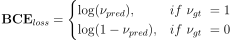

```python
import torch
import torch.nn as nn
#sigmoid将output的值映射到(0,1)区间
m = nn.Sigmoid()
criterion = nn.BCELoss()
criterion(m(output), target)

#BCEWithLogitsLoss在计算loss之间已经对output做了sigmoid操作
criterion = torch.nn.BCEWithLogitsLoss()
criterion(output, target)
```
</details>

<details>
<summary>Balanced BCEloss</summary>

## Balanced BCE


当 $\nu_{gt}$ 是 one-hot 类型时

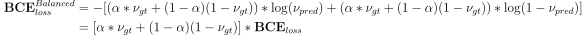

Balanced BCE 通过 $\alpha$ 控制正负样本的加权参数,改变正负样本参与loss计算的贡献比例,对目标检测类任务通过 $\alpha$ 平衡正负样本间的数量差异.

```python
import torch
import torch.nn as nn
"""
This code revised from the focal loss in yolov8
           https://github.com/ultralytics/ultralytics/yolo/utils/metrics.py
"""
class BalancedBCELoss(nn.Module):
    def __init__(self, alpha=0.75, reduction='mean'):
        super(BalancedBCELoss, self).__init__()
        self.loss_fcn = nn.BCEWithLogitsLoss()  # must be nn.BCEWithLogitsLoss()
        self.alpha = alpha
        self.reduction = reduction
        self.loss_fcn.reduction = 'none'  # required to apply FL to each element

    def forward(self, pred, true):
        loss = self.loss_fcn(pred, true)
        pred_prob = torch.sigmoid(pred)  # prob from logits
        alpha_factor = true * self.alpha + (1 - true) * (1 - self.alpha)
        loss *= alpha_factor

        if self.reduction == 'mean':
            return loss.mean()
        elif self.reduction == 'sum':
            return loss.sum()
        else:  # 'none'
            return loss
```
</details>

<details>
<summary>Focal loss</summary>

## Focal loss (FL)

paper: [Focal Loss for Dense Object Detection](https://arxiv.org/pdf/1708.02002.pdf)

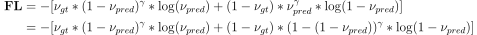

当 $\nu_{gt}$ 是 one-hot 类型时

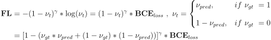

加入 $\alpha$ 正负样本均衡后,可表示如下:

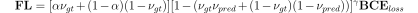 

<!--  -->
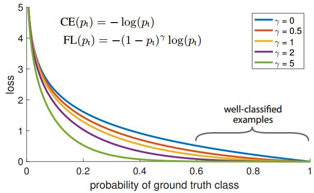

Focal loss 通过 $(1 - \nu_{t})^{\gamma}$ 控制难易样本参与loss计算的贡献比例, 对于正样本易分样本 $\nu_{pred}$ 越接近1, $(1 - \nu_{pred})^{\gamma}$ 接近0, 参与loss比例越小; 难分样本, $\nu_{pred}$ 越接近0, $(1 - \nu_{pred})^{\gamma}$ 接近1, 参与loss比例越大. 同样对于负样本, 易分样本 $\nu_{pred}$ 越接近0, $(1 - ( 1 - \nu_{pred}))^{\gamma} = \nu_{pred}^{\gamma}$ 接近0, 参与loss比例越小; 相反负样本的难分样本 $\nu_{pred}^{\gamma}$ 接近1, 参与loss比例越大.

当参数 $\gamma$ 越接近0时, Focal loss 越接近BCEloss.

```python
import torch
import torch.nn as nn
"""
This code referenced to
           https://github.com/ultralytics/ultralytics/yolo/utils/metrics.py
"""
class FocalLoss(nn.Module):
    def __init__(self, gamma=1.5, alpha=0.75, reduction='mean'):
        super(FocalLoss, self).__init__()
        self.loss_fcn = nn.BCEWithLogitsLoss()  # must be nn.BCEWithLogitsLoss()
        self.gamma = gamma
        self.alpha = alpha
        self.reduction = reduction
        self.loss_fcn.reduction = 'none'  # required to apply FL to each element

    def forward(self, pred, true):
        loss = self.loss_fcn(pred, true)
        pred_prob = torch.sigmoid(pred)  # prob from logits
        p_t = true * pred_prob + (1 - true) * (1 - pred_prob)
        alpha_factor = true * self.alpha + (1 - true) * (1 - self.alpha)
        modulating_factor = (1.0 - p_t) ** self.gamma
        loss *= alpha_factor * modulating_factor

        if self.reduction == 'mean':
            return loss.mean()
        elif self.reduction == 'sum':
            return loss.sum()
        else:  # 'none'
            return loss
```
</details>

<details>
<summary>Generalized Focal Loss</summary>

## Generalized Focal Loss (GFL)

paper:[Generalized Focal Loss: Learning Qualified and Distributed Bounding Boxes for Dense Object Detection](https://arxiv.org/pdf/2006.04388.pdf)

### Quality Focal Loss (QFL)

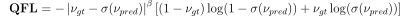

在QFL中负样本的真值 $\nu_{gt} = 0$, 正样本真值 $\nu_{gt} \in [0,1]$ 是0~1之间的概率值.

<image src="images/QualityFocalLoss.png">

图:当 $\nu_{gt} = 0.5$ 时, $-\left| \nu_{gt} - \sigma(\nu_{pred}) \right|^{\beta}$ 的变化趋势
<br/>


当真值 $\nu_{gt} \in {0,1}$ 是 one-hot类型时, QFL和FL具有相同的形式.

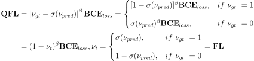

```python
import torch
import torch.nn as nn
"""
This code referenced to
           https://github.com/ultralytics/yolov5/utils/loss.py
"""
class QFocalLoss(nn.Module):
    def __init__(self, gamma=1.5, alpha=0.75, reduction='mean'):
        super(QFocalLoss, self).__init__()
        self.loss_fcn = nn.BCEWithLogitsLoss()  # must be nn.BCEWithLogitsLoss()
        self.gamma = gamma
        self.alpha = alpha
        self.reduction = reduction
        self.loss_fcn.reduction = 'none'  # required to apply FL to each element

    def forward(self, pred, true):
        loss = self.loss_fcn(pred, true)
        pred_prob = torch.sigmoid(pred)  # prob from logits
        alpha_factor = true * self.alpha + (1 - true) * (1 - self.alpha)
        modulating_factor = torch.abs(true - pred_prob) ** self.gamma
        loss *= alpha_factor * modulating_factor

        if self.reduction == 'mean':
            return loss.mean()
        elif self.reduction == 'sum':
            return loss.sum()
        else:  # 'none'
            return loss
```

### Distribution Focal Loss (DFL)

Distribution Focal Loss 在 Generalized Focal Loss 中被用作 box_regression. 求取offset形式的边界框(t,l,b,t),这里将 box_regression 问题中边界框的估计视作等效的脉冲响应的概率分布.有 $\int_\infty^\infty \delta(x-y)xdx = 1$ . 将对值的估计范围限制在 $[x_0,x_n]$ 之间,并且令分隔间隔等于1,最终对值的估计可以视为 

$\hat{y} = \int_\infty^\infty \delta(x-y)xdx \sim \int_{y_0}^{y_n} P(x_i)x_i = \sum_{i=0}^n P(x_i)x_i $, $ P(x_i) $ 表示在 $x_i$ 处对 $\hat{y}$ 的概率估计,且有 $\sum^n_{i=0} P(x_i) = 1$. 通过设定分度将边界的估计问题转化为对边界值的分布概率的估计问题.

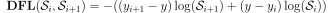,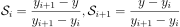

DFL的优化目标使得 $\hat{y}$ 概率映射到 $ceil(y)$ 和 $floor(y)$ 的线性加权和最小

```python
import torch
import torch.nn.functional as F
"""
This code revised from the dfl_loss in yolov8
           https://github.com/ultralytics/ultralytics/yolo/utils/loss.py
"""
class DFocalLoss(nn.Module):
    def __init__(self, ):
        super(DFocalLoss, self).__init__()

    def forward(pred_dist, target):  
        # pred_dist : num_select_anchors*4*reg分度， target : num_select_anchors×4
        # num_select_anchors = num_target_all_batch * select_topk
        # Return sum of left and right DFL losses
        # Distribution Focal Loss (DFL) proposed in Generalized Focal Loss https://ieeexplore.ieee.org/document/9792391
        tl = target.long()  # target left
        tr = tl + 1  # target right
        wl = tr - target  # weight left
        wr = 1 - wl  # weight right
        return (F.cross_entropy(pred_dist, tl.view(-1), reduction='none').view(tl.shape) * wl +
                F.cross_entropy(pred_dist, tr.view(-1), reduction='none').view(tl.shape) * wr).mean(-1, keepdim=True)
```


**torch.nn.functional.cross_entropy 
注意1:input不需要经过softmax,直接从fn层拿出来的张量就可以送入交叉熵中,因为在交叉熵中已经对输入input做了softmax了. 
注意2:不用对target进行one_hot编码,因为nll_loss函数已经实现了类似one-hot过程. 
referenced to https://blog.csdn.net/qq_38308388/article/details/121640312**
</details>

<details>
<summary>Varifocal Loss</summary>

## Varifocal Loss (VFL)

paper:[VarifocalNet: An IoU-aware Dense Object Detector](https://arxiv.org/pdf/2008.13367.pdf)

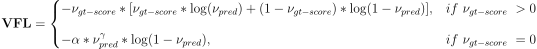

VFL以IoU-Aware Classification Score(IACS)作为优化目标, $\nu_{gt-score}$ 是pred_box和gt_box的IOU * $\nu_{gt}$. 

**注意:IOU和gt_cls生产过程如下:
1.IOU表示每个batch的pred_boxes和gt_boxes的交并比,对于batch>1的训练过程来说,IOU的维度为 $dim(batch, num\_anchors, max\_num\_gt)$, max_num_gt表示batch中image拥有最大的gt_boxes.
2.需要确定pred_boxes对gt_boxes的归属问题,采用center_belongs_to_grid或者tal的策略确定每个pred_boxes属于哪个gt_boxes获得target_gt_idx,将IOU的维度转化为 $iou_{trans}$ 维度为 $dim(batch, num\_anchors,1)$, $\nu_{gt}$ 的维度为 $dim(batch, num\_anchors, num\_classes)$, 可得到 $\nu_{gt-score} = \nu_{gt} * iou_{trans}$**

```python
import torch
import torch.nn.functional as F
"""
This code revised from the dfl_loss in yolov8
           https://github.com/ultralytics/ultralytics/yolo/utils/loss.py
"""
class VarifocalLoss(nn.Module):
    # Varifocal loss by Zhang et al. https://arxiv.org/abs/2008.13367
    def __init__(self, gamma=2.0, alpha=0.75, reduction='sum'):
        super().__init__()
        self.loss_fcn = nn.BCEWithLogitsLoss()  # must be nn.BCEWithLogitsLoss()
        self.loss_fcn.reduction = 'none'  # required to apply FL to each element
        self.alpha = alpha
        self.gamma = gamma
        self.reduction = reduction

    def forward(self, pred, gt_score, label):
        pred = pred.sigmoid()
        # weight = self.alpha * pred.pow(self.gamma) * (1 - gt_score.ge(0).float()) + gt_score
        weight = self.alpha * pred.pow(self.gamma) * (1 - label) + gt_score * label
        # with torch.cuda.amp.autocast(enabled=False):
        loss = self.loss_fcn(pred, gt_score) * weight
        if self.reduction == 'mean':
            return loss.mean()
        elif self.reduction == 'sum':
            return loss.sum()
        else:  # 'none'
            return loss
```

VFL要解决的问题是,在目标检测中正负样本不均衡,负样本的数量远远大于正样本,通过 $\nu_{pred}^\gamma$ 来削减负样本对结果的影响,对负样本估计 $\nu_{pred}^\gamma$ 值越小,即对越容易分类的负样本给予越低的权重,对越难估计的负样本给予越高的权重,更关注对于难估计的负样本的调整.对于正样本使用参数 $\nu_{gt}$ ,对框iou更大的目标给予更大的权重,使得网络更加关注对iou高的预测框的调整.
</details>

<details>
<summary>多分类损失函数</summary>

## 多分类损失函数

torch中单分类和多分类的损失没有什么重大的分别

**注意:在多分类的时候，我们希望输出是符合概率分布,问题即转化成为对于网络输出如何处理上.常见的有对输出做sigmoid或者softmax.二者均能把输出转换到(0,1)的区间内.但二者目的不同,对于softmax操作是考虑目标分类严格的参照 $\sum^n_{i=0} P(x_i) = 1 $, 例如在DFL对边界值的分布情况还有单个数字识别中的分类就存在这样的情况;对于sigmoid操作,更加关注当前 $\nu_{pred}$ 是否接近 $\nu_{gt}$,比如对一般的目标识别网络,不能简单的将所有分类互斥作为条件带入.**
</details>

<details>
<summary>IOU Loss</summary>

## IOU Loss

### IOU Loss

$\mathbf{IOU} = \frac{Intersection(b^{pred},b^{gt})}{Union(b^{pred},b^{gt})} = \frac{Intersection(b^{pred},b^{gt})}{\mathcal{S}^{pred} + \mathcal{S}^{gt} - Intersection(b^{pred},b^{gt})}$

$ Intersection(b^{pred},b^{gt}) = \mathbf{maximum}\left(\mathbf{minimum}(b^{pred}_r,b^{gt}_r)-\mathbf{maximum}(b^{pred}_l,b^{gt}_l),0 \right) * \mathbf{maximum}\left(\mathbf{minimum}(b^{pred}_b,b^{gt}_b)-\mathbf{maximum}(b^{pred}_t,b^{gt}_t),0\right) = \mathbf{I}_w * \mathbf{I}_h$

IOU_loss ($\cal{L}_{IOU}$)是anchor-pred的IOU和 $\nu_{gt}$ 的交叉熵, $\cal{L}_{IOU} =\nu_{gt}\log(IOU)+(1 - \nu_{gt})\log(1 - IOU)$

#### IOU backpropagation

paper:[UnitBox: An Advanced Object Detection Network](https://arxiv.org/pdf/1608.01471.pdf)

IOU_loss的反向传播需要计算 $b^{pred}$ 对于 $\cal{L}_{IOU}$ 中各项的偏导.

$\frac{\partial{\mathcal{S}^{pred}}}{\partial{b^{pred}_r}\ (\mathbf{or} \ \partial{b^{pred}_l})} = b^{pred}_b - b^{pred}_t \ ,\ \frac{\partial{\mathcal{S}^{pred}}}{\partial{b^{pred}_t}\ (\mathbf{or} \ \partial{b^{pred}_b})} = b^{pred}_r - b^{pred}_l $

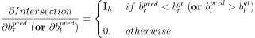,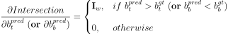

### GIOU

paper:[Generalized Intersection over Union: A Metric and A Loss for Bounding Box Regression](https://arxiv.org/pdf/1902.09630.pdf)

$\mathbf{GIOU} = \mathbf{IOU} - \frac{A^c-Union}{A^c}$

$A^c = \left(\mathbf{maximum}(b^{pred}_r,b^{gt}_r)-\mathbf{minimum}(b^{pred}_l,b^{gt}_l)\right) * \left(\mathbf{maximum}(b^{pred}_b,b^{gt}_b)-\mathbf{minimum}(b^{pred}_t,b^{gt}_t)\right) $

$\cal{L}_{GIOU} = 1 - \mathbf{GIOU} \ \in[0,2]$

**GIOU_Loss加入非重合区域的影响，当IOU值相同时，非重合区域占比越小，代表预测框与目标框的对比效果越好。**

### DIOU

paper:[Distance-IoU Loss: Faster and Better Learning for Bounding Box Regression](https://arxiv.org/pdf/1911.08287v1.pdf)

$\mathbf{DIOU} = \mathbf{IOU} - \left(\frac{\rho^2({bc}^{pred},{bc}^{gt})}{c^2}\right) = \mathbf{IOU} - \left(\frac{d^2}{c^2}\right)$

${bc}^{pred}$,${bc}^{gt}$ 表示pred_box和gt_box的中心点.d代表pred_box和gt_box的中心点距离,c代表pred_box和gt_box的最小外接矩形对角线长度。

$\cal{L}_{DIOU} = 1 - \mathbf{DIOU} \ \in[0,2]$

**DIOU_Loss用中心点的归一化距离代替了GIOU中的非重合区域占比指标,可以直接最小化两个目标框的距离，比GIOU收敛的更快.在目标框和预测框相互包裹的条件下，DIOU_Loss可以使回归非常快，而GIOU_Loss几乎退化为IOU Loss.**

### CIOU

paper:[Enhancing Geometric Factors in Model Learning and Inference for Object Detection and Instance Segmentation](https://arxiv.org/pdf/2005.03572.pdf)

$\mathbf{CIOU} = \mathbf{IOU} - \left(\frac{\rho^2({bc}^{pred},{bc}^{gt})}{c^2}+\alpha\nu\right),\ \nu = \frac{4}{\pi^2}(arctan\frac{w^{gt}}{h^{gt}}-arctan\frac{w}{h})^2,\ \alpha=\frac{\nu}{1-IOU+\nu}$

$\cal{L}_{CIOU} = 1 - \mathbf{CIOU} \ \in[0,2]$

**CIoU在DIoU的基础上增加了检测框尺度的loss，增加了长和宽的loss，使得预测框就会更加的符合真实框.CIOU使得评估更加准确,但增加了loss的计算量.**

```python
import torch
import math
"""
This code referenced to
           https://github.com/ultralytics/ultralytics/yolo/utils/metrics.py
"""
def bbox_iou(box1, box2, xywh=True, GIoU=False, DIoU=False, CIoU=False, eps=1e-7):
    # Returns Intersection over Union (IoU) of box1(1,4) to box2(n,4)

    # Get the coordinates of bounding boxes
    if xywh:  # transform from xywh to xyxy
        (x1, y1, w1, h1), (x2, y2, w2, h2) = box1.chunk(4, -1), box2.chunk(4, -1)
        w1_, h1_, w2_, h2_ = w1 / 2, h1 / 2, w2 / 2, h2 / 2
        b1_x1, b1_x2, b1_y1, b1_y2 = x1 - w1_, x1 + w1_, y1 - h1_, y1 + h1_
        b2_x1, b2_x2, b2_y1, b2_y2 = x2 - w2_, x2 + w2_, y2 - h2_, y2 + h2_
    else:  # x1, y1, x2, y2 = box1
        b1_x1, b1_y1, b1_x2, b1_y2 = box1.chunk(4, -1)
        b2_x1, b2_y1, b2_x2, b2_y2 = box2.chunk(4, -1)
        w1, h1 = b1_x2 - b1_x1, b1_y2 - b1_y1 + eps
        w2, h2 = b2_x2 - b2_x1, b2_y2 - b2_y1 + eps

    # Intersection area
    inter = (b1_x2.minimum(b2_x2) - b1_x1.maximum(b2_x1)).clamp(0) * \
            (b1_y2.minimum(b2_y2) - b1_y1.maximum(b2_y1)).clamp(0)

    # Union Area
    union = w1 * h1 + w2 * h2 - inter + eps

    # IoU
    iou = inter / union
    if CIoU or DIoU or GIoU:
        cw = b1_x2.maximum(b2_x2) - b1_x1.minimum(b2_x1)  # convex (smallest enclosing box) width
        ch = b1_y2.maximum(b2_y2) - b1_y1.minimum(b2_y1)  # convex height
        if CIoU or DIoU:  # Distance or Complete IoU https://arxiv.org/abs/1911.08287v1
            c2 = cw ** 2 + ch ** 2 + eps  # convex diagonal squared
            rho2 = ((b2_x1 + b2_x2 - b1_x1 - b1_x2) ** 2 + (b2_y1 + b2_y2 - b1_y1 - b1_y2) ** 2) / 4  # center dist ** 2
            if CIoU:  # https://github.com/Zzh-tju/DIoU-SSD-pytorch/blob/master/utils/box/box_utils.py#L47
                v = (4 / math.pi ** 2) * (torch.atan(w2 / h2) - torch.atan(w1 / h1)).pow(2)
                with torch.no_grad():
                    alpha = v / (v - iou + (1 + eps))
                return iou - (rho2 / c2 + v * alpha)  # CIoU
            return iou - rho2 / c2  # DIoU
        c_area = cw * ch + eps  # convex area
        return iou - (c_area - union) / c_area  # GIoU https://arxiv.org/pdf/1902.09630.pdf
    return iou  # IoU
```
</details>

<details>
<summary>PIOU Loss</summary>

## Pixels-IoU Loss (PIOU Loss)

paper:[PIoU Loss: Towards Accurate Oriented Object Detection in Complex Environments](https://arxiv.org/pdf/2007.09584.pdf)

PIOU Loss 要解决的问题：通过使用方向边界框oriented bounding boxes (OBB)进行目标检测可以减少目标与背景区域的重叠来更好地定位旋转对象。一般通过在水平边界框检测器引入由距离损失优化的附加角度尺寸构建的。但是这样导致估计与IoU的相关性较松散，对具有高纵横比的对象不敏感。

PIOU Loss推导如下：
对每个像素点 $\mathbf{p}_{i,j}$ 和obb框 $\mathbf{b}$ 有如下关系:

<image src="images/matheq/PIOU_pixel.svg">

其中：

<image src="images/matheq/PIOU_pixel_com.svg">

PIOU 表达形式：

<image src="images/matheq/PIOU.svg">

其中：

<image src="images/matheq/PIOU_cap.svg"><image src="images/matheq/PIOU_cap_cond.svg">

PIOU Loss的表示形式如下：

<image src="images/matheq/PIOU_loss.svg">

由于函数 $\delta()$ 不可导，用函数 $F()$ 来表示，当 $d-s > 0$ 时，$F()$ 趋近于1， 当 $d-s <0$ 时，$F()$ 趋近于0. 点$(i,j)$和方向边界框的关系由下图(a)表示。函数$F()$的形式由下图(b)表示。
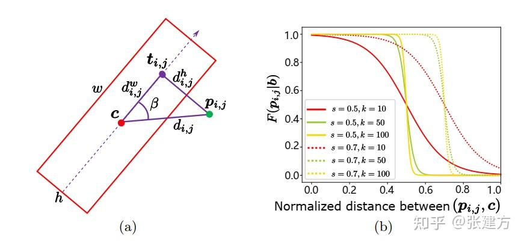

 There is an implementation for calculating Pixels-IoU Loss in the path "./piou". Although it not calculating in the form of pixel, it shows much more convenient parallel processing as the same as normal box-iou form. The code is forked from the repositories of https://github.com/zf020114/DARDet. I tried to give the explanation how this code calculating the intersection of a pair rotated boxes, Also working to revise an box assigner from tal for oriented bounding boxes detection.

</details>

<details>
<summary>PSC</summary>

## Phase-Shifting Coder

Paper:[Phase-Shifting Coder: Predicting Accurate Orientation in Oriented Object Detection](https://arxiv.org/pdf/2211.06368.pdf)

Phase-Shifting Coder 主要解决在方向边界框的估计问题中，角度变化过程中不连续的问题。对于一个范围在$(-\pi,\pi)$或者$(0,2\pi)$变化的角度值，其编码过程如下式：

<image src="images/matheq/pscencode.svg">

其解码过程如下：
<image src="images/matheq/pscdecode.svg">

由于cos值的范围在 $(-1,1)$ 之间，而sigmoid函数输出范围在 $(-1,1)$，计算loss时所用的 $x_{pred}$ 需要进行如下处理。

<image src="images/matheq/pscrescale.svg">

```python
"""PSC decode"""
import math
import torch

def psc_decode(theta_cos):
    theta_cos = theta_cos*2 - 1 
    my_sin = theta_cos[...,1]*math.sin(2/3*math.pi)+theta_cos[...,2]*math.sin(4/3*math.pi)
    my_cos = theta_cos[...,0]-theta_cos[...,1]/2-theta_cos[...,2]/2
    theta = torch.atan2(my_sin,my_cos)
    return -theta.unsqueeze(-1)
```
</details>

<details>
<summary>Smooth L1 loss</summary>

## Smooth L1 loss

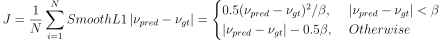

<image src="images/smooth_L1.png">
</details>

<details>
<summary>Wing loss</summary>

## Wing loss

paper:[Wing Loss for Robust Facial Landmark Localisation with Convolutional NeuralNetworks](https://arxiv.org/pdf/1711.06753.pdf)

wing loss是解决在关键点坐标回归过程中，传统的L1，L2 loss对异常值敏感的问题。在关键点坐标回归任务中神经网络的训练应该更多地关注具有小范围或中等范围误差的样本。

<image src="images/matheq/Wingloss.svg"><br/>

<image src="images/Wingloss.jpg">

```python
import math
import torch
class WingLoss(nn.Module):
    def __init__(self, omega=10, epsilon=2):
        super(WingLoss, self).__init__()
        self.omega = omega
        self.epsilon = epsilon
        self.C = self.omega - self.omega * math.log(1 + self.omega / self.epsilon)

    def forward(self, pred, target):
        y = target
        y_hat = pred
        delta_y = (y - y_hat).abs()
        delta_y1 = delta_y[delta_y < self.omega]
        delta_y2 = delta_y[delta_y >= self.omega]
        loss1 = self.omega * torch.log(1 + delta_y1 / self.epsilon)
        loss2 = delta_y2 - self.C
        return (loss1.sum() + loss2.sum()) / (len(loss1) + len(loss2))
```
</details>

<details>
<summary>Adaptive Wing loss</summary>

## Adaptive Wing loss

paper:[Adaptive Wing Loss for Robust Face Alignment via Heatmap Regression](https://arxiv.org/pdf/1904.07399v1.pdf)

wing loss 和 L1，L2 loss相比较有更加陡峭的曲线放大了小误差的影响，对小范围或中等范围误差的样本有更好的收敛。但是由于wing loss的导数不连续在距离为零的两侧发生跳变，因此估计值会在真值附近反复波动，并且很难实现无偏估计。

设计Adaptive Wing loss的要求是，对正样本loss影响（以及梯度）应该开始增加，以便训练能够集中于减少这些误差。然后，随着误差非常接近零(在某个邻域范围内时)，loss的影响应该会迅速减少，这样这些“足够好”的像素就不再被关注。

<image src="images/matheq/Awingloss.svg">

其中：

<image src="images/matheq/Awing_cond.svg"> <br/> 

<image src="images/Awingloss.jpg">

</details>