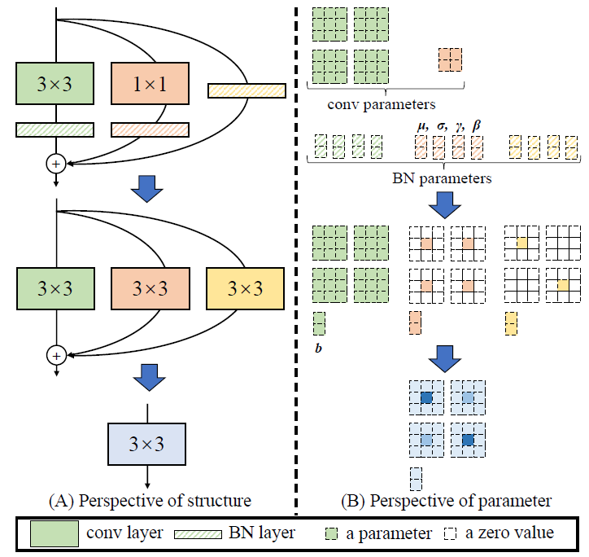
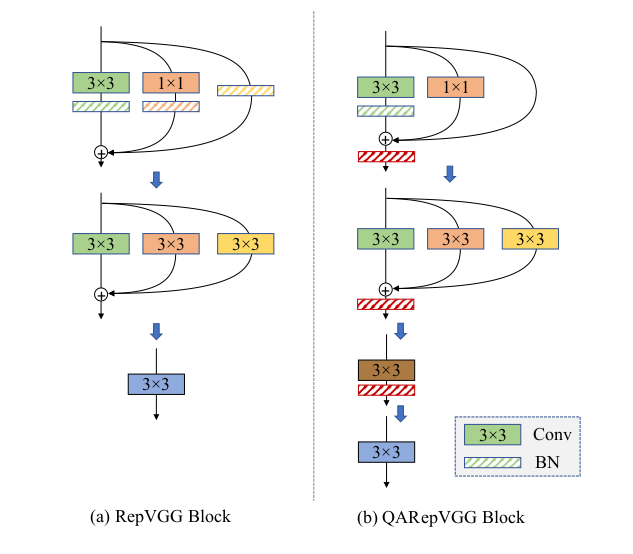

# Summary of YOLOv6

This is a summary of yolov8 learning process. It contains some tasks implementation process, model structrue, code annotation.

The original repository link is: https://github.com/meituan/YOLOv6

Implementation of paper:
- [YOLOv6 v3.0: A Full-Scale Reloading](https://arxiv.org/abs/2301.05586)
- [YOLOv6: A Single-Stage Object Detection Framework for Industrial Applications](https://arxiv.org/abs/2209.02976)

## YOLOv6文件结构以及文件功能介绍

```
.
|
|-- assets                                  # 量化实验的权重默认文件夹
|   |-- yolov6s_v2_reopt.pt
|   `-- yolov6s_v2_scale.pt
|-- configs
|   |-- base/                               # anchor base yolov6网络的配置文件
|   |-- experiment/                         # 包含评估参数的配置文件
|   |-- qarepvgg/                           # 使用QARepVGGBlock作为基本元件构建的anchor base yolov6网络的配置文件
|   |-- repopt/                             # 量化实验时所使用的yolov6网络的配置文件
|   |-- yolov6(?).py                        # anchor free yolov6网络的配置文件
|   `-- yolov6(?)6.py                       # 增加一层feature map结构的anchor free yolov6网络的配置文件
|-- data/                                   # 多种类型数据格式文件配置
|   `-- images/                             # 测试图像文件夹
|-- deploy
|   |-- ONNX
|   |   |-- OpenCV
|   |   |   |-- coco.names
|   |   |   |-- sample.jpg
|   |   |   |-- yolo.py                     # 加载ONNX模型对image数据进行推断并展示
|   |   |   |-- yolo_video.py               # 加载ONNX模型对video数据进行推断并展示
|   |   |   |-- yolov5
|   |   |   |   |-- CMakeLists.txt
|   |   |   |   `-- yolov5.cpp
|   |   |   |-- yolov6
|   |   |   |   |-- CMakeLists.txt
|   |   |   |   `-- yolov6.cpp
|   |   |   |-- yolox
|   |   |   |   |-- CMakeLists.txt
|   |   |   |   `-- yolox.cpp
|   |   |   `-- yolox.py
|   |   |-- eval_trt.py
|   |   `-- export_onnx.py                  # 加载FP32 model,进行RepVgg旁路结构向conv变换的deploy,按是否end2end,simplify,将pt模型转换为ONNX模型
|   |-- OpenVINO
|   |   `-- export_openvino.py              # 加载FP32 model,进行RepVgg旁路结构向conv变换的deploy,将pt模型转换为ONNX模型和OpenVINO模型
|   `-- TensorRT
|       |-- CMakeLists.txt
|       |-- Processor.py
|       |-- calibrator.py
|       |-- eval_yolo_trt.py
|       |-- logging.h
|       |-- onnx_to_trt.py
|       |-- visualize.py
|       `-- yolov6.cpp
|-- tools
|   |-- partial_quantization                # 项目中独立的ptq过程
|   |   |-- eval.py                         # 调用 Evaler.eval_model进行evaluation结果统计
|   |   |-- eval.yaml                       # partial量化模型的配置文件
|   |   |-- partial_quant.py                # 读取量化模型和sensitivity-layers,按配置生成对应的partial量化模型,调用eval统计模型性能,最终输出成partial量化的onnx模型
|   |   |-- ptq.py                          # 1.load_ptq和do_ptq分别进行量化模型加载和执行量化操作
|   |   |                                   #     2.使用nvidia pytorch-quantization库对conv,maxpool层进行数据校准和量化
|   |   |                                   #     3.partial_quantization可以有选择的跳过某些层并对剩下可以量化的层进行量化
|   |   |-- sensitivity_analyse.py          # 对整个模型量化,以及各个layer层单独量化,比较互相之间对于mAP的影响,输出sensitivity-layers
|   |   `-- utils.py                        # 量化模型的加载保存参数状态修改
|   |-- qat
|   |   |-- onnx_utils.py                   
|   |   |-- qat_export.py                   # 输出量化模型到ONNX模型
|   |   `-- qat_utils.py                    # 为Trainer类提供qat_init_model_manu,skip_sensitive_layers加载量化模型.
|   |-- quantization
|   |   |-- ppq
|   |   |   |-- ProgramEntrance.py
|   |   |   `-- write_qparams_onnx2trt.py
|   |   `-- tensorrt
|   |       |-- post_training
|   |       |   |-- Calibrator.py
|   |       |   |-- onnx_to_tensorrt.py
|   |       |   `-- quant.sh
|   |       `-- training_aware
|   |           `-- QAT_quantizer.py
|   |-- eval.py                             # evaluation过程调用的主函数入口,进行参数解析,创建Evaler类的实例进行校验
|   |-- infer.py                            # inferer过程调用的主函数入口,进行参数解析,创建Inferer类的实例进行推断
|   `-- train.py                            # train过程调用的主函数入口,进行参数解析,并检验权重和配置文件的路径存在判断是否要下载.创建Trainer类的实例进行训练
|-- weights                                 # 权重文件夹
|   `-- yolov6n.pt
|-- yolov6
|   |-- __init__.py
|   |-- assigners                           # 训练过程中的正样本分配策略 
|   |   |-- __init__.py
|   |   |-- anchor_generator.py             # 计算feature map上每个位置的anchor偏移量,缩放比例
|   |   |-- assigner_utils.py               # 为assigner提供框选择计算,gt-pred iou,为ATSSassigner提供gt-anchor center距离计算
|   |   |-- atss_assigner.py                # 训练过程中的目标框(正样本)分配策略ATSS: Adaptive Training Sample Selection Assigner
|   |   |-- iou2d_calculator.py             # 为assigner提供gt-anchor iou
|   |   `-- tal_assigner.py                 # 训练过程中的目标框(正样本)分配策略TAL:Task Alignment Learning 
|   |-- core
|   |   |-- engine.py                       # Trainer类:1.__init__中实例化dataloader,optimizer,加载模型在qat时加载教师模型,在qat时执行模型量化.
|   |   |                                   #     2.train_before_loop实例化损失函数 3.train_after_loop清空显存
|   |   |                                   #     4.train_in_loop调用prepare_for_steps,train_in_steps进行网络训练,调用eval_and_save进行结果评估和checkpoint保存
|   |   |                                   #     5.prepare_for_steps加载新step数据并用pbar显示进度 6.train_in_steps进行网络前向运算,计算loss,更新optimizer
|   |   |-- evaler.py                       # Evaler类:1.大部分作为实例对象的函数在eval中调用,实现了自己的数据加载,模型加载,前向运算和结果统计,数据format变换 
|   |   |                                   #     2.为Trainer类,tensorRT evaluation过程,PTQ evaluation过程 提供了eval_model函数调用,统计evaluation结果的map和速度
|   |   `-- inferer.py                      # inferer类:包括推断过程的预处理(大小变换),RepVgg旁路结构向conv变换的deploy,模型输出变换到原图,结果作图显示
|   |-- data
|   |   |-- data_augment.py                 # 1.为TrainValDataset类提供扩增变换函数 2.letterbox在train,evaluation,inferer过程中将图像大小变换到适合网络的大小
|   |   |-- data_load.py                    # 为train,evaluation过程提供dataloader,通过TrainValDataLoader加载TrainValDataset实现
|   |   |-- datasets.py                     # TrainValDataset类:实现voc和yolo数据集的图像和label存在检验,读取,扩增变换并最终转换成yolo format
|   |   |-- vis_dataset.py                  # voc数据集图像+框的显示
|   |   `-- voc2yolo.py                     # 转换voc数据集成yolo格式
|   |-- layers
|   |   |-- common.py                       # 基本模型单元结构
|   |   `-- dbb_transforms.py               
|   |-- models
|   |   |-- efficientrep.py                 # 多种结构Backbone网络
|   |   |-- effidehead.py                   # 多种结构Head网络
|   |   |-- end2end.py                      # 进行end2end export 模型时,为tensorRT和ONNX提供nms算子结构
|   |   |-- heads
|   |   |   |-- effidehead_distill_ns.py    # qat过程时,比一般的Head增加一条offset框回归的分支
|   |   |   `-- effidehead_fuseab.py        # anchor-aided training(AAT)的Head网络,对框回归包含anchor-base和anchor-free两条分支
|   |   |-- losses                          
|   |   |   |-- loss.py                     # 损失函数的实现,分类loss采用VFL,box_reg_loss采用DFL,iou_loss采用giou
|   |   |   |-- loss_distill.py             # yolo大网络,进行qat时loss的计算,几乎和loss_distill_ns一样
|   |   |   |-- loss_distill_ns.py          # yolos,yolon进行qat时loss的计算,计算学生网络的VFL,DFL,giou_loss.计算教师网络和学生网络之间分类网络输出的KL散度,feature_map中各像素的KL散度
|   |   |   `-- loss_fuseab.py              # AAT时loss的计算,和loss.py几乎一样,在engine.py的train_in_steps中anchor-base和anchor-free两条分支的loss各计算一遍
|   |   |-- reppan.py                       # 多种结构Neck(PAN)网络
|   |   `-- yolo.py                         # Model类:创建模型实例,初始化模型,加载模型权重的位置,并提供forward模型调用的前向计算.
|   |-- solver
|   |   `-- build.py                        # 为train过程提供optimizer
|   `-- utils
|       |-- Arial.ttf
|       |-- RepOptimizer.py
|       |-- checkpoint.py                   # train过程中checkpoint的加载与保存
|       |-- config.py                       # 实现adddict类型的配置文件加载
|       |-- ema.py                          # ModelEMA类:在训练过程中实现权重和参数的滑动平均更新
|       |-- envs.py                         # 运行环境读入,GPU选择
|       |-- events.py                       # 实现yaml文件加载,将evaluation的统计结果写入log,在tensorboard上模型结果显示
|       |-- figure_iou.py                   # 多种iou_type下的IOUloss计算
|       |-- general.py                      # 提供bbox框的数据表示形式变换,xyxy下的iou计算,last_checkpoint加载,对save路径返回不存在的并加以新建,模型下载
|       |-- metrics.py                      # 为evaluation过程提供结果统计和统计结果作图
|       |-- nms.py                          # box-nms计算
|       `-- torch_utils.py                  # 提供cuda任务时钟,权重初始化,conv+bn权值融合,模型参数量计算
|-- docs/                                   # The guidence explains how to use the ro repository
|-- runs/                                   # 任务运行过程中及结果的保存位置
`-- hubconf.py

```

## RepVgg

### 融合Conv层与BN层加速模型inference

Conv + BN 结构在网络的推理阶段，可以将BN层的运算融合到Conv层中，减少运算量，加速推理。本质上是在不增加Conv层计算量的同时，修改了卷积核的参数，略去了BN层的计算量。

Conv + BN 的输入输出关系如下: 

$$ output = \gamma\frac{w*input + b - \mu}{\sqrt{\sigma^2+\epsilon}} + \beta$$

$w$是conv_weight,$b$是conv_bias,$\gamma$是BN层缩放系数,$\mu$是BN层running_mean,$\sigma$是BN层running_variance,$\beta$是BN层bias,$\epsilon$是BN层eps

变换后Conv + BN 的输入输出关系如下: 

$$output = \frac{\gamma w}{\sqrt{\sigma^2+\epsilon}} * input + \beta - \frac{\gamma(\mu - b)}{\sqrt{\sigma^2+\epsilon}}$$

$$output = \hat{w} * input + \hat{b} , \hat{w} = \frac{\gamma w}{\sqrt{\sigma^2+\epsilon}},\hat{b} = \beta - \frac{\gamma(\mu - b)}{\sqrt{\sigma^2+\epsilon}}$$

```python
"""
This code revised from the _fuse_extra_bn_tensor in yolov6 QARepVGGBlock
        https://github.com/meituan/YOLOv6/tree/main/yolov6/layers/commom.py
We discuss the parameter dimension, make sure there won't be any problem in 2D conv.
"""
import torch.nn as nn
import torch
import numpy as np
                                                           
def fuse_conv_and_bn(conv, bn):
    assert isinstance(conv, nn.Conv2d)
    assert isinstance(bn, nn.BatchNorm2d)
    weight = conv.weight                                   # dim(conv.weight) = (output_channels,input_channels/num_groups,kernel_size_h,kernel_size_w)
    if conv.bias is None:
        running_mean = bn.running_mean
    else:
        running_mean = bn.running_mean - conv.bias         # dim(bn.running_mean) = dim(conv.bias) = (output_channels)
    running_var = bn.running_var                           # dim(bn.running_var) = (output_channels)
    gamma = bn.weight                                      # dim(bn.bn.weight) = (output_channels)
    beta = bn.bias                                         # dim(bn.bn.bias) = (output_channels)
    eps = bn.eps                                           # dim(bn.bn.eps) = (output_channels)
    std = (running_var + eps).sqrt()                       # dim = (output_channels)
    t = (gamma / std).reshape(-1, 1, 1, 1)                 # dim = (output_channels,1,1,1)
    return weight * t, beta - running_mean * gamma / std
```
### RepVgg

- Implementation of paper:[RepVGG: Making VGG-style ConvNets Great Again](https://arxiv.org/pdf/2101.03697.pdf)

#### RepVGG解决的痛点

- (1)复杂的分支设计（如ResNet和Inception）使其难以应用和自定义，降低了推理的速度并且内存占用率较高；

- (2)一些组件（如depthwise卷积）增加了内存访问成本且缺乏适用的硬件；

- (3) 原有的VGG网络存在退化问题，网络层数增加，但是在训练集上的准确率却饱和甚至下降了

#### RepVGG解决问题思路

通过使用结构重参数化解耦了训练和推理过程，训练时为多分支结构、推理时为plain结构;

首先考虑到ResNet多分支结构虽然对推理不友好，但是对训练友好.设计了一个shortcut分支结构:$y = x + g(x) + f(x)$，其中:$g(x)$代表$1*1$卷积，$f(x)$代表$3*3$卷积。

而在推理阶段，利用重参数化(融合Conv层与BN层),将$y = x + g(x) + f(x)$转换为$y = h(x)$，从而实现训练阶段利用了多分支的优势，而在推理阶段利用了plain网络的优势。



#### 推理阶段的重参数化过程解析：

由于分支都有一个BN层，因此，需要将BN和卷积层融合（将shortcut分支视为一个 $1*1$ 卷积层）;

卷积和BN融合后，得到了一个 $3*3$ 卷积和两个 $1*1$ 卷积，需要将$1*1$卷积通过zero-padding的方式变成 $3*3$ 卷积;

最后将3个 $3*3$ 卷积加起来，即可得到一个单一的 $3*3$ 卷积。

参考博客:[RepVGG: Making VGG-style ConvNets Great Again](https://blog.csdn.net/oYeZhou/article/details/112798915)

```python
def conv_bn(in_channels, out_channels, kernel_size, stride, padding, groups=1):
    result = nn.Sequential()
    result.add_module('conv', nn.Conv2d(in_channels=in_channels, out_channels=out_channels,
                                                  kernel_size=kernel_size, stride=stride, padding=padding, groups=groups, bias=False))
    result.add_module('bn', nn.BatchNorm2d(num_features=out_channels))
    return result

class MyRepVGGBlock(nn.Module):
    '''
    Here we revise the code to make it easier to understand the process of Repvgg reparameterization
    '''
    def __init__(self, in_channels, out_channels, kernel_size=3,
                 stride=1, padding=1, dilation=1, groups=1, padding_mode='zeros', deploy=False):
        super(MyRepVGGBlock, self).__init__()
        self.deploy = deploy
        self.groups = groups
        self.in_channels = in_channels
        self.out_channels = out_channels
        self.stride = stride

        assert kernel_size == 3
        assert padding == 1

        self.padding_11 = padding - kernel_size // 2

        self.nonlinearity = nn.ReLU()

        if deploy:
            self.rbr_reparam = nn.Conv2d(in_channels=in_channels, out_channels=out_channels, kernel_size=kernel_size, stride=stride,
                                      padding=padding, dilation=dilation, groups=groups, bias=True, padding_mode=padding_mode)

        else:
            self.rbr_identity = nn.BatchNorm2d(num_features=in_channels) if out_channels == in_channels and stride == 1 else None
            self.rbr_dense = conv_bn(in_channels=in_channels, out_channels=out_channels, kernel_size=kernel_size, stride=stride, padding=padding, groups=groups)
            self.rbr_1x1 = conv_bn(in_channels=in_channels, out_channels=out_channels, kernel_size=1, stride=stride, padding=self.padding_11, groups=groups)

    def forward(self, inputs):
        if hasattr(self, 'rbr_reparam'):
            return self.nonlinearity(self.rbr_reparam(inputs))

        if self.rbr_identity is None:
            id_out = 0
        else:
            id_out = self.rbr_identity(inputs)

        return self.nonlinearity(self.rbr_dense(inputs) + self.rbr_1x1(inputs) + id_out)

    def get_equivalent_kernel_bias(self):
        kernel3x3, bias3x3 = self._fuse_bn_tensor(self.rbr_dense)
        kernel1x1, bias1x1 = self._fuse_bn_tensor(self.rbr_1x1)
        kernelid, biasid = self._fuse_bn_tensor(self.rbr_identity)
        return kernel3x3 + kernel1x1 + kernelid, bias3x3 + bias1x1 + biasid

    def _pad_1x1_to_3x3_tensor(self, kernel1x1):
        return torch.nn.functional.pad(kernel1x1, [1,1,1,1])

    def _fuse_bn_tensor(self, branch):
        if branch is None:
            return 0, 0
        if isinstance(branch, nn.BatchNorm2d):
            conv = nn.Conv2d(in_channels=self.in_channels, out_channels=self.out_channels, kernel_size=1, stride=self.stride, padding=self.padding_11, groups=self.groups, bias=False)
            input_dim = self.in_channels // self.groups
            if self.groups == 1:
                kernel_value = torch.eye(self.in_channels, device=conv.weight.data.device)
            else:
                kernel_value = np.zeros((self.in_channels, input_dim, 3, 3), dtype=np.float32)
                for i in range(self.in_channels):
                    kernel_value[i, i % input_dim] = 1
                kernel_value = torch.from_numpy(kernel_value).to(branch.weight.device)
            kernel_value = kernel_value.reshape(self.in_channels,input_dim,1,1)
            conv.weight.data = kernel_value
            bn = branch
        else:
            assert isinstance(branch, nn.Sequential)
            conv = branch.conv
            bn = branch.bn
        kernel, bias = fuse_conv_and_bn(conv,bn)
        if kernel.shape[-1] == 1:
            kernel = self._pad_1x1_to_3x3_tensor(kernel)
        return kernel, bias

    def switch_to_deploy(self):
        if hasattr(self, 'rbr_reparam'):
            return
        kernel, bias = self.get_equivalent_kernel_bias()
        self.rbr_reparam = nn.Conv2d(in_channels=self.rbr_dense.conv.in_channels, out_channels=self.rbr_dense.conv.out_channels,
                                     kernel_size=self.rbr_dense.conv.kernel_size, stride=self.rbr_dense.conv.stride,
                                     padding=self.rbr_dense.conv.padding, dilation=self.rbr_dense.conv.dilation, groups=self.rbr_dense.conv.groups, bias=True)
        self.rbr_reparam.weight.data = kernel
        self.rbr_reparam.bias.data = bias
        del_list = ['rbr_dense','rbr_1x1','rbr_identity']
        for layer in del_list:
            if hasattr(self, layer):
                self.__delattr__(layer) 
        self.deploy = True
```

### QARepVGG

- Implementation of paper:[Make RepVGG Greater Again: A Quantization-aware Approach](https://arxiv.org/pdf/2212.01593.pdf)

#### QARepVGG解决的痛点

- RepVGG重参数训练得到的模型在量化时出现了严重的性能下降

#### QARepVGG解决问题思路

量化误差由张量分布因子(包含最大值、最小值、标准差以及阶段阈值)决定。虽然不能对网络内部张量做任何假设，但可以认为一个量化友好的分布应当具有较小的数值范围、较小的标准差。对于重参数类架构而言，它有两个主要成分(权值、激活张量)需要进行量化且均可能导致性能退化，激活张量同时还将作为下一层的输入，因此误差会逐层累积 。因此，具有好的量化性能的网络需要满足两个基本条件:

- 1.权值分布有利于量化;
- 2.激活张量分布易于进行量化

针对条件1,通过分析INT8量化后的模型各层权值分布,不存在特别的异常值.
针对条件2,由于无法通过对输入分布进行假设并得出具体结论。因此对每个分支的标准差进行分析。

RepVGG网络的输入输出关系表示如下:

$$
output = \sum_{i=1}^{3}(input * W_i,\mu,\sigma,\gamma,\beta) = \sum_{i=1}^{3}\gamma_i\frac{1}{\sqrt{\sigma_i^2+\epsilon}}(input * W_i-\mu_i)
$$

每个分支的方差由下式表示:

$$
D(output) = \frac{\gamma_i^2}{\sigma_i^2+\epsilon} D(input*W_i)
$$

BN层的参数$\sigma$,$\gamma$会影响量化误差的分布.这里跳过对于custemL2的分析.通过分析各条通道上的$\frac{\gamma_i^2}{\sigma_i^2+\epsilon}$值,得到在$1*1$和identity通道存在异常.

S2:先取消identity通路的BN层.考虑误差的反向传递,$3*3$,$1*1$分支的输出分布均值为$\beta_{(3)}$,$\beta_{(1)}$,在相同的初始化条件下$\beta_{(3)}^0 = \beta_{(1)}^0$,根据SGD的优化迭代方式,有如下:
$$E({output}^{k}) = \beta_{(3)}+\beta_{(1)}+\beta_{(0)}$$
$$\beta_{(3)}^{k+1} = \beta_{(3)}^k - {lr}^{k+1} * \frac{\partial{l(W,\gamma,\beta)}}{\partial{\beta_{(3)}^k}} = \beta_{(3)}^k - {lr}^{k+1} * \frac{\partial{l(W,\gamma,\beta)}}{\partial{{output}^{k+1}}} = \beta_{(1)}^k - {lr}^{k+1} * \frac{\partial{l(W,\gamma,\beta)}}{\partial{{output}^{k+1}}} = \beta_{(1)}^{k+1}$$
假设使得输出维持0均值分布$\beta_{(3)}+\beta_{(1)}+\beta_{(0)} = 0$, $\beta_{(3)}=\beta_{(1)}=-\beta_{(0)}/2$.因为$E(output_0)=E(ReLU(input))\ge0$,要使得0均值成立,会造成方差增大.

结论:S2验证了仅取消identity通路的BN层效果不好的原因

S3:取消identity和$1*1$卷积通路的BN层,结果获得了很大提升

S4:取消identity和$1*1$卷积通路的BN层,在三条分支求和后增加一个BN层.后增加的BN层可以稳定训练过程.

最终QARepVGG的结构为$BN(BN(3×3) + (1×1) + Identity)$

参考博客:[RepVGG: Making VGG-style ConvNets Great Again](https://zhuanlan.zhihu.com/p/590173269)



```python
class MyQARepVGGBlock(MyRepVGGBlock):

    def __init__(self, in_channels, out_channels, kernel_size=3,
                 stride=1, padding=1, dilation=1, groups=1, padding_mode='zeros', deploy=False):
        super(MyQARepVGGBlock, self).__init__()
        if not deploy:
            self.bn = nn.BatchNorm2d(out_channels)
            self.rbr_1x1 = nn.Conv2d(in_channels, out_channels, kernel_size=1, stride=stride, groups=groups, bias=False)
            self.rbr_identity = nn.Identity() if out_channels == in_channels and stride == 1 else None

    def forward(self, inputs):
        if hasattr(self, 'rbr_reparam'):
            return self.nonlinearity(self.rbr_reparam(inputs))

        if self.rbr_identity is None:
            id_out = 0
        else:
            id_out = self.rbr_identity(inputs)

        return self.nonlinearity(self.bn(self.rbr_dense(inputs) + self.rbr_1x1(inputs) + id_out))

    def get_equivalent_kernel_bias(self):
        kernel3x3, bias3x3 = self._fuse_bn_tensor(self.rbr_dense)
        kernel = kernel3x3 + self._pad_1x1_to_3x3_tensor(self.rbr_1x1.weight)
        bias = bias3x3

        if self.rbr_identity is not None:
            input_dim = self.in_channels // self.groups
            kernel_value = np.zeros((self.in_channels, input_dim, 3, 3), dtype=np.float32)
            for i in range(self.in_channels):
                kernel_value[i, i % input_dim, 1, 1] = 1
            kernel = kernel + torch.from_numpy(kernel_value).to(self.rbr_1x1.weight.device)
        conv = nn.Conv2d(in_channels=self.in_channels, out_channels=self.out_channels, kernel_size=1, stride=self.stride, 
            padding=self. padding_11, groups=self.groups, bias=True)    
        conv.weight.data, conv.bias.data = kernel, bias  
        kernel, bias = fuse_conv_and_bn(conv , self.bn)
        return kernel,bias
```

## YOLOv6的量化过程

### Post-Training Quantization(PTQ)

### Quantization-Aware Training(QAT)
